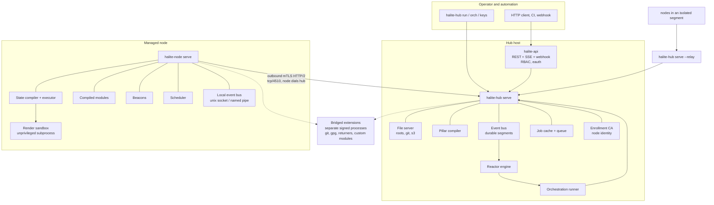

# Halite: A Configuration Management and Remote Execution System

- Status: Draft v1
- Date: 2026-08-19
- Owner: ed.silva
- Applies to: a replacement for SaltStack (Salt) in Everbridge estates
- Language: Go 1.25 or later, standard library only, with a closed dependency allowlist

## 1. Purpose

This specification defines a replacement for Salt. The replacement keeps the parts of Salt that
carry operational value and discards the parts that carry risk.

The design has these goals, in priority order:

1. **Keep state and pillar.** Existing SLS trees are the asset. The state compiler, the pillar
   compiler, the YAML dialect, and the template dialect must accept real Salt trees.
2. **Eliminate the third-party supply chain.** The shipped artifact links no third-party code
   except a named allowlist that a reviewer can read in an afternoon. See section 4.
3. **Ship three static binaries.** One for the managed endpoint, one for the central service, one
   for the HTTP API. No interpreter, no site-packages, no shared objects, no plugin loading.
4. **Keep reactors, orchestration, beacons, and remote execution.** These four are the automation
   surface that operators depend on after state and pillar.
5. **Remove the master/minion vocabulary.** See section 2.

Salt's functional model is sound. Salt's implementation model is a Python interpreter plus a
transitive dependency tree of several hundred packages, a bespoke encryption protocol, a dynamic
module loader that imports arbitrary code from the file server, and a history of
unauthenticated pre-auth remote code execution in the central service. This specification keeps
the first and replaces the rest.

### 1.1 What this document is not

This is a design specification, not a migration plan and not an implementation. It defines
behaviour, protocols, file formats, and the compatibility boundary. It states plainly where Salt
behaviour is **not** reproduced, because an unstated gap becomes an outage.

## 2. Naming

### 2.1 Role names

The `master` and `minion` pair is replaced. The replacement is not a euphemism for the same
relationship; it names what each component actually does.

| Salt term | This specification | Reason |
|---|---|---|
| master | **hub** | It is a message hub, a file server, and a pillar compiler. It does not command; it publishes and nodes subscribe. |
| minion | **node** | A managed endpoint. Neutral, and already the industry term. |
| salt-api | **api** | Unchanged. Already accurate. |
| syndic | **relay** | It relays between hubs. |
| master of masters | **root hub** | Plain. |
| minion blackout | **quiesce** | Describes the state, not a colour. |
| minion key acceptance | **enrollment** | Describes the act. |

The project name is **Halite** — the mineral name for rock salt. It signals lineage without
inheriting the vocabulary. The name is provisional; `Sylvite`, `Natron`, and `Brine` are
alternates. Nothing in this specification depends on the choice.

### 2.2 Binaries

Exactly three binaries ship, as required.

| Binary | Role | Replaces |
|---|---|---|
| `halite-node` | Endpoint agent and local executor | `salt-minion`, `salt-call`, `salt-proxy` |
| `halite-hub` | Central service, file server, pillar compiler, and the full operator CLI | `salt-master`, `salt`, `salt-run`, `salt-key`, `salt-cp`, `salt-ssh`, `salt-syndic` |
| `halite-api` | HTTP API service | `salt-api` |

Salt ships eleven or more entry points. Folding the operator CLI into `halite-hub` and the local
executor into `halite-node` holds the count at three without losing a command. Each binary
dispatches on its first argument:

```
halite-hub   serve | run | runner | orch | keys | files | ssh | event | jobs | lint | migrate | version
halite-node  serve | call | grains | pillar | state | event | lint | version
halite-api   serve | token | policy | version
```

`halite-hub run '<target>' <function>` is the old `salt` command. `halite-node call state.apply` is
the old `salt-call`. The operator muscle memory transfers; the process count does not.

A node never needs `halite-hub`. A hub never needs `halite-node`. Neither needs `halite-api`.

### 2.3 Lexicon policy

The rename is not limited to two words. The following terms are prohibited in source, in
configuration keys, in log output, in metric names, in documentation, and in test fixtures. CI
fails the build on a match outside the compatibility shim in section 28.3.

| Prohibited | Required |
|---|---|
| master, slave | hub, node, primary, replica, source, target |
| minion | node |
| whitelist, blacklist | allowlist, denylist |
| sanity check | validity check, precondition |
| dummy | placeholder, stub |
| grandfathered | legacy-exempt |
| man hours | person hours |

Salt's own configuration uses `state_whitelist`, `state_blacklist`, `master`, `master_finger`,
`minion_id`, and similar. The compatibility shim reads those keys, emits one deprecation warning
per key per process start, and maps them to the new names. The shim is a defined, dated, removable
surface, not an exception to the policy.

Retained Salt vocabulary, because it is accurate and carries no baggage: **grains**, **pillar**,
**mine**, **state**, **top file**, **SLS**, **highstate**, **beacon**, **reactor**,
**orchestration**, **runner**, **returner**, **requisite**, **saltenv** (renamed `env`, with
`saltenv` accepted as an alias in templates and targeting for compatibility).

## 3. Scope

### 3.1 In scope

- The state system: SLS compilation, requisites, ordering, `include`, `extend`, `exclude`,
  test mode, and the state return schema.
- The pillar system: pillar roots, pillar top files, external pillar via a bridged interface,
  merge strategies, and encrypted pillar.
- The YAML dialect Salt uses, including its YAML 1.1 boolean quirks and mapping-order preservation.
- A Jinja2-compatible template engine sufficient for real SLS trees.
- Remote execution: targeting, job dispatch, returns, batching, and the job cache.
- Reactors, orchestration, runners, beacons, the event bus, and the scheduler.
- The file server, `halite://` and `salt://` URIs, and file hashing.
- Grains on Linux, Windows, macOS, and FreeBSD.
- Enrollment, identity, transport, and authorization.
- An HTTP API with a defined authentication and RBAC model.
- An agentless mode equivalent to `salt-ssh`.
- A defined out-of-process extension protocol for everything not compiled in.
- FIPS 140-3 builds.

### 3.2 Out of scope

- Any Python. No embedded interpreter, no `py` renderer, no Python execution modules, no
  `__virtual__`, no `salt.utils` surface.
- In-process plugin loading of any kind. Extensions run as separate processes. See section 24.
- Salt Cloud, Salt Virt, `salt-proxy` for vendor SDK targets, Windows Group Policy modules, and
  the vendor-specific module families (network device modules, hypervisor modules, cloud
  provider modules) beyond what section 15 lists.
- Salt's ZeroMQ transport, its RSA-plus-AES message envelope, and its `AES` key rotation scheme.
  Section 6 replaces all three.
- Feature parity with Salt's roughly 400 execution modules and roughly 300 state modules.
  Section 15 defines the set that ships and the tier system for the rest.
- Salt's Python API (`salt.client.LocalClient` and peers). The HTTP API and the CLI are the
  programmatic surfaces.
- The Salt Project's own release channels, repositories, and package signing keys.

## 4. Language and dependency policy

This section is the headline requirement. It has teeth: CI enforces it, and a violation fails the
build rather than raising a warning.

### 4.1 Language selection

**Go 1.25 or later.**

| Requirement | Go | Rust | Zig |
|---|---|---|---|
| Cross-platform breadth | linux, windows, darwin, freebsd, openbsd, netbsd, solaris, aix; amd64, arm64, arm, riscv64, ppc64le, s390x | Comparable tier 1/2 | Comparable, smaller tier 1 |
| Cross-compile without a target toolchain | Yes, `GOOS`/`GOARCH`, no C toolchain | Needs a linker per target in practice | Yes |
| Single static binary by default | Yes, `CGO_ENABLED=0` | Yes, with musl work | Yes |
| Standard library covers HTTP/2, TLS 1.3, X.509, JSON, archive, compression, crypto, ASN.1, regexp, template | Yes | No. Each is a crate. | No. Each is a package. |
| FIPS 140-3 validated cryptographic module in the toolchain | Yes, native since 1.24 | Third-party | No |
| Third-party code required to reach the goal | Near zero | Dozens of crates before the first line of business logic | Growing, immature |

Go wins on the one axis that dominates: a program written against the Go standard library needs
almost no third-party code to do everything in this specification. Rust is the better language in
the abstract and the worse language for this goal, because `serde`, `tokio`, `rustls`, `clap`,
`regex`, and their transitive graphs reintroduce exactly the supply chain this project exists to
remove. The choice is driven by the requirement, not by preference.

Go's specific weaknesses are accepted and mitigated: no YAML parser in the standard library
(section 10.1 specifies one), `text/template` is not Jinja (section 10.2 specifies an engine),
and `regexp` is RE2 rather than PCRE (section 10.4 states the consequence honestly).

### 4.2 Dependency allowlist

`go.mod` contains at most the modules in this table. Adding a module requires an ADR, a named
reviewer, and an amendment to this section.

| Module | Tier | Justification | Exit plan |
|---|---|---|---|
| `golang.org/x/sys` | 1 | Windows, BSD, and Solaris syscalls and Win32 API bindings are impractical to hand-roll and change with OS releases. Maintained by the Go team under the Go proposal and review process. Pure Go, no cgo. | None required. Reviewed on each bump. |
| `golang.org/x/term` | 2 | Terminal size and raw mode for CLI prompts, on platforms where `x/sys` alone is awkward. | Removable; drop the interactive prompt. |

Everything else is the standard library. Notably, these are implemented in-house rather than
imported, and each has a section in this document:

| Capability | Salt's dependency | Here |
|---|---|---|
| YAML parsing | PyYAML | Section 10.1, defined subset |
| Templating | Jinja2, MarkupSafe | Section 10.2, defined subset |
| Transport | pyzmq, libzmq, tornado | Section 6, stdlib `net/http` HTTP/2 over mutual TLS |
| Serialization | msgpack-python | `encoding/json`, canonical form, section 6.4 |
| Crypto and message envelope | pycryptodome, bespoke protocol | `crypto/tls`, `crypto/x509`, `crypto/ecdsa`, `crypto/hkdf`, `crypto/pbkdf2` |
| Metrics | prometheus_client | Section 26.2, text exposition format written directly |
| LDAP authentication | python-ldap, OpenLDAP | Section 23.3, bind-only client over `encoding/asn1` |
| OIDC and JWT | authlib, cryptography | Section 23.4, verification over stdlib crypto |
| S3 file server and pillar | boto3, botocore | Section 13.4, SigV4 written directly |
| GPG-encrypted pillar | python-gnupg | Section 12.6, the system `gpg` binary, bridged |
| Git file server and pillar | pygit2, GitPython, libgit2 | Section 13.3, the system `git` binary, bridged |
| SSH for agentless mode | paramiko or the ssh binary | Section 21, the system `ssh` binary |
| Database returners | mysqlclient, psycopg2, redis-py | Section 20.3, bridged out-of-process |
| Inotify beacon | pyinotify | Section 16.2, raw `inotify` syscalls |
| Cron parsing | croniter | Section 20.1, written directly |

The pattern is consistent. Where a capability is small and well-specified, write it. Where it is
large and needs a vendor protocol, shell out to a signed system binary the operating system
already trusts. Where it is neither, push it out of process behind a documented protocol so the
third-party code never shares an address space with the agent.

### 4.3 Build and release integrity

| Control | Requirement |
|---|---|
| cgo | `CGO_ENABLED=0` for every shipped artifact. Verified by `go version -m`, which must report no cgo. |
| Reproducibility | `-trimpath`, `-buildvcs=true`, pinned Go toolchain version in `go.mod` via the `toolchain` directive, `SOURCE_DATE_EPOCH` honoured. Two builders on two machines must produce identical digests, and CI verifies this on every tag. |
| Vendoring | `vendor/` is committed for the allowlist. Builds run `-mod=vendor`. The build network is disabled; `GOFLAGS=-mod=vendor GOPROXY=off`. |
| Dependency assertion | CI runs `go mod graph` and fails if any module outside section 4.2 appears, at any depth. |
| Toolchain provenance | The Go toolchain is fetched by digest from an internal mirror, not by version tag. |
| SBOM | CycloneDX generated from `go version -m` output on the shipped binary, not from the source tree. What linked, not what was declared. |
| Signing | Detached signature per artifact plus an in-toto/SLSA provenance attestation naming the source commit, the toolchain digest, and the builder identity. |
| Binary hygiene | No embedded network fetches at build time, no code generation from a remote source, no `go:generate` step that reaches the network. |
| FIPS | A parallel build with `GOFIPS140=v1.0.0`, using the Go Cryptographic Module. Runtime enforcement with `GODEBUG=fips140=on`. Section 27.4. |

### 4.4 What the policy costs

Stated plainly, because the trade is real. This design gives up: Salt's enormous module library,
the ability for a site to drop a Python file into `_modules/` and have it loaded on the next
`saltutil.sync_all`, and PCRE regex semantics. Section 24 provides a replacement for the second at
the cost of a process boundary. Sections 15 and 28 quantify the first. Section 10.4 states the
third.

## 5. Architecture



### 5.1 Direction of connection

The node dials the hub. The hub never dials the node.

This inverts Salt's exposure. Salt requires the hub to listen on 4505 and 4506 and requires every
node to reach both, but a node still listens on nothing — so the change is not about the node's
listening surface, it is about the hub's. In Salt, the hub's publish and request ports process
attacker-controlled bytes before authentication completes, which is the precise shape of
CVE-2020-11651. Here the hub listens on exactly one TCP port, and the first thing that happens on
that port is a TLS 1.3 mutual handshake terminated by the standard library. No application code
observes a byte from an unauthenticated peer.

Consequences, stated so nobody is surprised:

- A hub cannot reach a node that has not connected. There is no "wake up and connect" path. A node
  that is off is unreachable, exactly as in Salt.
- Jobs for a disconnected node are queued or dropped by policy. See section 9.5.
- NAT and one-way firewalls become easy rather than hard. A node behind NAT needs no inbound rule.

### 5.2 Process model

| Component | Runs as | Notes |
|---|---|---|
| `halite-hub serve` | Dedicated unprivileged account `halite` | Needs no root. Binds 4510 via a socket unit or `CAP_NET_BIND_SERVICE` if a privileged port is chosen; 4510 is unprivileged. |
| `halite-api serve` | Dedicated unprivileged account `halite-api` | Separate account from the hub. Talks to the hub over the same authenticated transport as a privileged client, not over a private back door. |
| `halite-node serve` | root, or SYSTEM on Windows | Package and service management require it. Section 25.4 describes privilege reduction inside the process. |
| Render sandbox | Unprivileged child of `halite-node` | YAML and template parsing, the largest attack surface, never runs as root. |
| Bridged extension | Configurable, defaults to the caller's reduced identity | Section 24. |

`halite-api` being a distinct process on a distinct account is deliberate. In Salt, `salt-api`
loads the master's own configuration and calls into master internals, so an API flaw is a master
flaw. Here the API is a client with a scoped identity, and its worst case is bounded by its RBAC
policy.

### 5.3 Relays

`halite-hub serve --relay --upstream <hub>` accepts node connections and presents itself upstream
as a single client that proxies jobs, returns, events, and file requests. It replaces the syndic.

Improvements over the syndic, which is the least reliable component in a large Salt estate:

- The relay has a durable spool. An upstream outage does not lose returns.
- Event forwarding is explicit and filterable by tag glob, rather than all-or-nothing.
- The relay compiles pillar for its nodes only if configured to; by default it forwards the pillar
  request upstream, so pillar has one source of truth.
- Relay depth is limited to 2 by default and is a configured maximum, because unbounded nesting is
  how syndic estates become undebuggable.

## 6. Transport

### 6.1 Substrate

**HTTP/2 over TLS 1.3 with mutual X.509 authentication, on one TCP port, default 4510.**

This is the single largest supply chain reduction in the design, so the reasoning is recorded. Salt
uses ZeroMQ for framing and multiplexing and layers a bespoke RSA-plus-AES envelope on top,
because ZeroMQ has no authentication. That is roughly 90,000 lines of C in `libzmq`, a Python
binding, and a hand-rolled cryptographic protocol which has been the source of multiple critical
CVEs. Every one of those functions — framing, multiplexing, flow control, stream priority,
authentication, confidentiality, integrity, replay resistance, and peer identity — is present in
the Go standard library's `net/http` and `crypto/tls`, implemented once and reviewed by the Go
security team.

- ALPN protocol identifier: `halite/1`. A peer that does not offer it is rejected at handshake.
- TLS 1.3 only. TLS 1.2 is not offered, in either direction.
- HTTP/1.1 with chunked transfer is a documented fallback for environments with an HTTP/1-only
  middlebox. It costs multiplexing: the node then holds two connections instead of one.
- No plaintext mode exists. There is no `transport: tcp` equivalent without TLS, not even for
  loopback, because that setting is invariably found in production.

### 6.2 Channels over one connection

The node opens one HTTP/2 connection and uses these endpoints. HTTP/2 supplies stream
multiplexing and per-stream flow control, so a large file transfer cannot stall job delivery.

| Endpoint | Method | Direction | Purpose |
|---|---|---|---|
| `/v1/subscribe` | POST | Long-lived, hub writes to node | Job publication, event push, and control messages. Request body carries the node's initial state; response body is an unterminated NDJSON stream. |
| `/v1/return` | POST | Node to hub | Job returns, one request per return, idempotent by `(jid, node_id, chunk)`. |
| `/v1/event` | POST | Node to hub | `event.send` from the node into the hub bus. |
| `/v1/pillar` | POST | Node to hub | Pillar compilation request. Body carries grains; hub compiles and responds. |
| `/v1/files/{env}/{path}` | GET | Node to hub | File server fetch. Supports `If-None-Match`, `Range`, and `Accept-Encoding: gzip`. |
| `/v1/files/{env}` | GET | Node to hub | File list and hash manifest for an environment or subtree. |
| `/v1/grains` | PUT | Node to hub | Grain refresh push. |
| `/v1/mine` | POST | Node to hub | Mine update and mine query, subject to the peer policy in section 19.5. |
| `/v1/health` | GET | Any to hub | Liveness. The only endpoint reachable without a client certificate, and it returns a fixed string with no state. |

The `/v1/subscribe` stream carries NDJSON messages. One JSON object per line, no trailing state, so
a truncated stream is unambiguous.

```json
{"t":"job","jid":"20260819T142211123456","fun":"state.apply","arg":["webserver"],"kwarg":{"test":true},"env":"base","ret":"","expires":"2026-08-19T14:37:11Z","nonce":"..."}
{"t":"ping","seq":4412}
{"t":"event","tag":"halite/hub/quiesce/start","data":{}}
{"t":"revoke","reason":"enrollment revoked","final":true}
```

Message types on the subscribe stream: `job`, `ping`, `event`, `revoke`, `reload`, `quiesce`,
`drain`. Nodes reply to `ping` on `/v1/return` with a `pong`; a missed ping budget triggers a
reconnect from the node side.

### 6.3 Replay and job authenticity

Mutual TLS authenticates the channel. It does not by itself prevent a compromised or malicious hub
operator from replaying an old job, so jobs carry their own guarantees:

| Field | Purpose |
|---|---|
| `jid` | Monotonic, hub-assigned, `YYYYMMDDThhmmssffffff` for operator readability and Salt familiarity |
| `nonce` | 128-bit random, recorded by the node in a bounded replay cache keyed by `jid` |
| `expires` | Absolute RFC 3339 timestamp. A node refuses a job past expiry. Default TTL 15 minutes; orchestration steps may extend it. |

A node refuses a job whose `jid` it has already executed, whose `nonce` it has already seen, or
whose `expires` has passed, and returns a structured refusal rather than dropping it silently.

Optionally, and recommended for regulated estates, jobs are **detached-signed** by an operator key
distinct from the hub's TLS key (section 25.6). The node verifies the signature before execution.
This means hub compromise alone does not yield fleet-wide code execution, which is not true of
Salt and not true of most of its competitors.

### 6.4 Serialization

`encoding/json` throughout, in a canonical form: UTF-8, sorted object keys where a digest is taken
over the value, no NaN or infinity, integers within the int64 range, and `HTMLEscape` disabled.

JSON rather than msgpack, deliberately. msgpack is more compact and would need a third-party
package or an in-house codec; JSON is in the standard library, is inspectable in a packet capture
and in a log, and compresses well. Payloads above a 4 KiB threshold use `compress/gzip`, which
recovers most of the size difference. Where a compact binary form is later shown to be necessary
by the performance work in section 30, it is added as a negotiated content type, not as a
replacement.

Numbers are the known JSON hazard. The wire format uses `json.Number` semantics on decode and
never converts through float64, so a 64-bit integer grain such as `mem_total` in bytes or a
package epoch survives a round trip. Salt has bugs here; this design does not inherit them.

### 6.5 Limits

Every limit is configured, has a default, and is enforced before allocation. Salt's absence of
these is why a single malformed return can exhaust a master.

| Limit | Default |
|---|---|
| Maximum request body | 64 MiB |
| Maximum single return payload | 16 MiB, then the node paginates by chunk |
| Maximum NDJSON line on the subscribe stream | 1 MiB |
| Maximum concurrent HTTP/2 streams per node connection | 64 |
| Maximum node connections per hub | 25,000, configured |
| Maximum decompressed size ratio | 100:1, then the transfer is aborted |
| Handshake timeout | 10 s |
| Idle stream timeout | 90 s |
| Maximum grains payload | 1 MiB |

## 7. Identity, enrollment, and trust

### 7.1 Node identity

A node's identity is an X.509 certificate issued by the hub's enrollment CA, with the node ID in
the subject common name and in a URI SAN of the form `halite://node/<node_id>`. The URI SAN is
authoritative; the CN is for human readability.

| Build | Key algorithm | Signature |
|---|---|---|
| Default | ECDSA P-256 | ECDSA with SHA-256 |
| High assurance | ECDSA P-384 | ECDSA with SHA-384 |
| FIPS 140-3 | ECDSA P-256 or P-384 | As above |
| Legacy interoperability | RSA-3072 or RSA-4096 | RSA-PSS with SHA-256 |

Ed25519 is not the default. It is the better algorithm and it is not approved under FIPS 140-3, and
this estate has FIPS hosts. Ed25519 is permitted in non-FIPS builds by configuration, and the
protocol negotiates it, but the default is ECDSA so that one certificate profile works everywhere.

The node's private key is generated on the node, never leaves it, and is stored at
`/etc/halite/pki/node.key` with mode `0600`, or in the Windows certificate store for the machine,
or in a TPM or PKCS#11 token where configured. Salt generates the node key on the node too; the
difference here is that the hub never holds anything that can impersonate a node.

### 7.2 Node ID determination

In order, first match wins:

1. `node_id` in the configuration file.
2. `HALITE_NODE_ID` in the environment.
3. The contents of `/etc/halite/node_id`.
4. A cloud instance identifier, when `node_id_source: cloud` is set. IMDSv2 only on EC2, with a
   token request; IMDSv1 is never used.
5. The fully qualified domain name.
6. The hostname.

The resolved ID is written to `/etc/halite/node_id` on first successful enrollment and is then
stable. Salt's ID instability after a DNS or DHCP change is a recurring source of duplicate keys;
pinning at enrollment removes it.

### 7.3 Enrollment

Three modes. The default is the safe one.

| Mode | Behaviour | When |
|---|---|---|
| `manual` (default) | The node submits a certificate signing request. It sits in `pending`. An operator runs `halite-hub keys accept <node_id>`, having compared the CSR public key digest out of band. | Default; small and medium estates |
| `token` | The node presents a bootstrap token at enrollment. A valid, unexpired, unspent token causes automatic issuance. | Autoscaling; image bakes must not embed a long-lived token |
| `attested` | The node presents a cloud instance identity document or a TPM attestation, which the hub verifies against the cloud provider's signing key or the TPM manufacturer's roots, then issues. | Autoscaling in a supported cloud; the strongest option |

Bootstrap tokens: 256-bit random, stored on the hub as a SHA-256 digest only, scoped to an
optional node-ID glob and an optional source CIDR, single-use by default, with a mandatory TTL
whose maximum is 24 hours. A token cannot be created without a TTL. Salt's `auto_accept: True`
has no equivalent here and no configuration key produces it; `token` and `attested` are the
supported automatic paths, and both are accountable.

### 7.4 Key lifecycle

| State | Meaning |
|---|---|
| `pending` | CSR received, not yet decided |
| `accepted` | Certificate issued and valid |
| `rejected` | Explicitly refused; the CSR is retained for audit |
| `revoked` | Previously accepted, now revoked; serial is on the CRL |
| `expired` | Certificate past `notAfter`, awaiting renewal or revocation |

Certificate lifetime defaults to 90 days. A node renews at 50% of lifetime by presenting its
current certificate and a new CSR to `/v1/enroll/renew`; renewal needs no operator action and no
token. This is deliberate: short-lived credentials with automatic renewal, rather than Salt's
permanent keys, so that a stolen node key has a bounded useful life.

Revocation is immediate and does not depend on the CRL propagating: the hub keeps an in-memory
denylist of revoked serials checked at handshake time by the TLS `VerifyPeerCertificate` callback,
and it pushes a `revoke` control message down any live subscribe stream for that node, which
causes the node to delete its key material and stop.

`halite-hub keys` subcommands: `list`, `show`, `accept`, `reject`, `revoke`, `delete`, `rotate-ca`,
`fingerprint`, `token create|list|revoke`, `export-crl`.

### 7.5 CA rotation

The enrollment CA supports overlapping generations. `halite-hub keys rotate-ca` creates a new CA
key, publishes a bundle containing both the old and the new CA to nodes, waits for renewal to
migrate the fleet, then retires the old CA. The hub's own serving certificate and the CA are
separate keys; the CA key may live in a PKCS#11 token or in an external KMS through the bridged
signer interface, so that it need not be on the hub's disk at all.

## 8. Targeting

Targeting is evaluated on the hub, against the last-known grains, pillar, and connection state of
each node. Salt evaluates most target types on the minion, which means every minion sees every
job. That is a confidentiality flaw: in Salt, a compromised minion learns the target expression and
arguments of jobs meant for other minions. Here, a node receives only jobs it matched.

### 8.1 Target types

| Type | Flag | Syntax | Notes |
|---|---|---|---|
| glob | default | `web*.prod` | Against node ID. `path.Match` semantics. |
| list | `-L` | `web1,web2` | Exact IDs. |
| regex | `-E` | `^web[0-9]+$` | RE2. See section 10.4. |
| grain | `-G` | `os_family:Debian` | Colon-delimited path, glob on the value. |
| grain regex | `-P` | `osrelease:^22\.` | RE2. |
| pillar | `-I` | `role:webserver` | Compiled pillar, hub side. |
| pillar regex | `-J` | `role:^web` | RE2. |
| subnet or IP | `-S` | `10.0.0.0/8`, `10.0.0.5` | Against `ipv4` and `ipv6` grains. |
| nodegroup | `-N` | `prod_web` | Named compound expression from configuration. |
| compound | `-C` | `G@os_family:Debian and not web5` | Section 8.2. |
| range | — | — | **Not supported.** Salt's SECO range needs an external service and library. Use nodegroups. |

Salt's `-R` range and `-A` (IP-based, deprecated in Salt) are absent. That is the entire list of
target types Salt has that this does not.

### 8.2 Compound expressions

The grammar is fully specified rather than left to a regex, because Salt's compound matcher has
had precedence bugs.

```
expr    := orExpr
orExpr  := andExpr ( "or" andExpr )*
andExpr := notExpr ( "and" notExpr )*
notExpr := "not" notExpr | primary
primary := "(" expr ")" | typed | glob
typed   := TYPE "@" VALUE
TYPE    := "G" | "P" | "I" | "J" | "L" | "S" | "E" | "N"
```

Precedence is `not`, then `and`, then `or`. Parentheses group. An unparseable expression is an
error that names the offending token and its column; it never degrades into a broader match. A
target that matches nothing is reported as matching nothing and is not an error, but the CLI exits
non-zero with `--require-match`.

Nodegroups may reference other nodegroups with `N@name`, to a depth of 10, and a cycle is a
configuration error detected at load rather than at use.

### 8.3 Staleness

Hub-side targeting depends on cached grains, so staleness is a real hazard and is made visible
rather than hidden.

- Each node's grain cache carries a timestamp and the node's connection state.
- Targeting a node whose grains are older than `grain_stale_after` (default 1 hour) includes it but
  annotates the job result, and `halite-hub run` prints a warning naming the stale nodes.
- `--fresh` forces a grain refresh on all connected candidates before evaluating the expression,
  at the cost of a round trip.
- A grain refresh happens on node start, on `notify`-driven change detection for the underlying
  source where available, and on a configurable interval, default 30 minutes with splay.

## 9. Remote execution

### 9.1 Job flow

1. The operator or the API submits a target expression, a function name, and arguments.
2. The hub authorizes the request against the RBAC policy in section 23.5. Deny by default.
3. The hub resolves the target to a node set and assigns a `jid`.
4. The hub writes the job to the job cache with state `dispatched` and the resolved node set, so
   that the expected respondent list is known and a missing return is detectable.
5. The hub writes the job message to each matched node's subscribe stream, through a bounded
   worker pool.
6. Each node validates the job (section 6.3), acknowledges, executes, and posts returns.
7. The hub records returns, fires events, and streams results to the caller.

### 9.2 Function dispatch

Function names keep Salt's `module.function` form. Arguments keep Salt's CLI conventions:
positional arguments, `key=value` keyword arguments, `key='["a","b"]'` for structured values, and
`--arg-json` for an unambiguous JSON argument vector when quoting becomes unreasonable.

Salt's YAML-parses-every-CLI-argument behaviour is not reproduced. It is the cause of a long tail
of surprises, such as a package version `1.0` becoming a float and `NO` becoming a boolean.
Arguments are strings unless a type is declared, and each module function declares its parameter
types in a machine-readable signature. `--legacy-arg-parse` restores the old coercion for a
transition period and logs each coercion it performs.

`halite-hub run` output formats: `--out=nested` (default, Salt-compatible rendering),
`json`, `yaml`, `highstate`, `table`, `txt`, `quiet`, and `--out-diff` for state runs. The `json`
output schema is frozen and versioned, so downstream tooling can depend on it.

### 9.3 Batching and concurrency

| Control | Meaning |
|---|---|
| `--batch=N` or `--batch=25%` | Execute against at most N nodes at a time, waiting for returns before advancing |
| `--batch-wait=S` | Settle time between batches |
| `--batch-safe-limit=N` | Abort the batch if more than N nodes fail |
| `--subset=N` | Execute against a random N of the matched set |
| `--async` | Return the `jid` immediately |
| `--timeout=S` | Per-node return timeout |
| `--gather-timeout=S` | Overall gather window after the last return |
| `--progress` | Live progress, distinguishing dispatched, returned, failed, and unresponsive |

Batching is implemented on the hub, not in the CLI. In Salt, `--batch` is client-side, so closing
the terminal abandons the batch mid-flight. Here the batch is a hub-side job group with its own
record, so it survives client disconnection and is resumable with `halite-hub jobs resume <jid>`.

### 9.4 Returns and the job cache

The return schema is deliberately Salt's, so existing dashboards and returners keep working:

```json
{
  "jid": "20260819T142211123456",
  "id": "web1.prod",
  "fun": "state.apply",
  "fun_args": ["webserver"],
  "success": true,
  "retcode": 0,
  "return": {},
  "out": "highstate",
  "start_time": "2026-08-19T14:22:11.123456Z",
  "duration_ms": 4182,
  "node_version": "1.0.0",
  "schema": "halite.ret/1"
}
```

The default job cache is a local append-only store under `/var/lib/halite/jobs`, segmented by day,
with an index for lookup by `jid`, node, function, and time range. Retention is by age and by total
size, whichever binds first, and expiry is enforced by the hub rather than by an external cron job.
Salt's `local_cache` growth without bound is a common cause of a full disk on a master; this
design will not do that.

`halite-hub jobs` subcommands: `list`, `show <jid>`, `lookup <jid>`, `missing <jid>`, `active`,
`resume <jid>`, `kill <jid>`, `prune`, `export`.

### 9.5 Offline nodes

Per-job policy, because there is no single correct answer:

| Policy | Behaviour |
|---|---|
| `skip` (default for ad-hoc) | Nodes not connected are reported as unresponsive and receive nothing |
| `queue` | The job is spooled for the node and delivered on its next connection, if `expires` has not passed |
| `require` | The job fails immediately if any matched node is not connected |

`queue` needs care and the design makes the hazard explicit: a node that returns after two weeks
should not apply a two-week-old job. The `expires` field bounds this, the default TTL for a queued
job is 1 hour, and a queued job that expires produces an event and an audit record rather than
silence.

### 9.6 Concurrency on the node

A node executes jobs serially by default, which matches Salt and avoids two `apt` runs colliding.

- A named lock per module family (`pkg`, `service`, `file`) allows safe parallelism between
  families while serializing within one.
- `--parallel` marks a job as safe to run alongside others.
- A long-running job does not block the subscribe stream; the stream reader and the executor are
  separate goroutines with a bounded queue between them.
- `halite-node` refuses a job when its queue is full and says so, rather than growing memory. Salt's
  minion under a reactor storm does the latter.

## 10. Renderers

An SLS file passes through a renderer pipeline named by a shebang-style first line, defaulting to
`#!jinja|yaml`. The pipeline is a template stage followed by a serializer stage, exactly as in Salt.

| Renderer | Support | Notes |
|---|---|---|
| `jinja` | Subset, section 10.2 | The default template stage |
| `yaml` | Subset, section 10.1 | The default serializer stage |
| `json` | Full | `encoding/json` |
| `mako` | Not supported | Rare in practice. Migration required. |
| `wempy`, `genshi`, `cheetah` | Not supported | Effectively unused. |
| `py` | Not supported | Requires Python. Migration path in section 28.4. |
| `pydsl`, `pyobjects` | Not supported | As above. |
| `yamlex` | Not supported | Salt-specific. `!aggregate` semantics are replaced by the state `aggregate` option. |
| `gpg` | Bridged, section 12.6 | Via the system `gpg` binary |
| `crypt` | New, section 12.5 | Native encrypted pillar |
| `text` | Full | Passthrough, no parsing |
| `stateconf` | Not supported | Rare; use `include` and `extend`. |
| `exec` | New, section 24.4 | Delegates rendering to a bridged process, which is the escape hatch for anything above |

### 10.1 The YAML subset

There is no YAML parser in the Go standard library, and importing one would breach section 4.2. A
parser is therefore specified and written. The subset is defined by what real Salt trees contain,
not by the YAML specification, and it is intentionally strict.

#### 10.1.1 Supported

- Block mappings and block sequences, at any nesting depth, with indentation-based structure.
- Flow mappings `{a: 1, b: 2}` and flow sequences `[1, 2, 3]`, including nested.
- Plain, single-quoted, and double-quoted scalars, with the full double-quoted escape set
  (`\n`, `\t`, `\\`, `\"`, and the numeric forms `\x41`, `\u0041`, `\U00000041`, plus `\0`,
  `\a`, `\b`, `\f`, `\r`, `\v`,
  `\e`, `\N`, `\_`, `\L`, `\P`, and escaped line folds).
- Block scalars `|` and `>`, with chomping indicators `-` and `+` and explicit indentation
  indicators. Correct folding semantics for `>`, including the "more-indented lines are not
  folded" rule, which naive implementations get wrong and which matters for `file.managed`
  `contents`.
- Anchors `&name`, aliases `*name`, and merge keys `<<:` with both a single alias and a sequence of
  aliases, with correct override precedence. Heavily used in pillar.
- Comments, including trailing comments after a value, with the rule that `#` starts a comment only
  at the start of a line or after whitespace.
- Multiple documents separated by `---`, with `...` terminators. An SLS file with more than one
  document is an error; multiple documents are permitted only where a caller asks for a stream.
- Explicit key indicator `? ` for simple keys.
- The tags `!!str`, `!!int`, `!!float`, `!!bool`, `!!null`, `!!seq`, `!!map`, `!!binary`, and
  `!!timestamp`.
- Byte order mark at the start of a stream, consumed and ignored.

#### 10.1.2 Rejected, with a diagnostic

- Any tag not in the list above, including all `!!python/...` tags. This is not an oversight but a
  security property: `yaml.load` with object construction is how a YAML file becomes code
  execution, and this parser has no code path that can construct anything but the nine types above.
- Complex mapping keys, that is a mapping or sequence used as a key.
- Duplicate keys in one mapping. An error naming both line numbers. PyYAML's silent last-wins is a
  frequent, invisible cause of a state that does nothing.
- Tab characters used for indentation.
- Non-UTF-8 input.
- Recursive anchors, alias depth beyond 100, and alias expansion whose total node count exceeds a
  configured budget. This closes the billion-laughs class of attack.
- YAML 1.1 sexagesimals such as `1:30` parsing as 90. Treated as a string, matching YAML 1.2 and
  matching operator intent.

#### 10.1.3 The scalar resolution rules, stated exactly

This is where a naive reimplementation breaks an existing tree, so the rules are fixed here.

| Input | Resolves to | Rationale |
|---|---|---|
| `true`, `True`, `TRUE`, `false`, `False`, `FALSE` | bool | YAML 1.1 and 1.2 agree |
| `yes`, `Yes`, `YES`, `no`, `No`, `NO`, `on`, `On`, `ON`, `off`, `Off`, `OFF`, `y`, `Y`, `n`, `N` | **bool** | YAML 1.1 only. PyYAML does this, so Salt does this, so existing trees depend on it. A lint warning is emitted every time, naming file and line, and `yaml_bool_11: false` switches the file or the tree to YAML 1.2 semantics after the tree has been audited. |
| `null`, `Null`, `NULL`, `~`, empty | null | |
| `0o17`, `017` | int, octal | Both forms, matching PyYAML |
| `0x1F` | int, hex | |
| `1_000` | int, 1000 | YAML 1.1 underscores |
| `.inf`, `-.Inf`, `.NAN` | float | Rejected on the wire per section 6.4; permitted in a local value |
| `2026-08-19`, `2026-08-19T14:22:11Z` | **string** | Salt does not want a timestamp type here, and a date silently becoming a struct breaks `file.managed` content |
| Anything else | string | |

Mapping order is preserved. This is not optional: Salt's state ordering follows declaration order in
the file, so the parser produces an ordered mapping type, and the state compiler consumes that
order. A Go `map` is never used to hold a parsed mapping.

#### 10.1.4 Diagnostics and source mapping

Every parsed node retains file, line, and column. The template stage emits a source map from
rendered output lines back to template source lines, and the YAML stage resolves errors through
that map. The result is that a YAML error in a heavily templated SLS file reports the position in
the `.sls` file the operator wrote, and shows both the source line and the rendered line.

Salt reports the rendered position or nothing at all, and diagnosing a templated highstate failure
is consequently a well-known misery. Fixing it is a stated goal of this design, not a nicety.

`halite-node lint <path>` and `halite-hub lint <tree>` render and parse without executing, and
report unsupported constructs, YAML 1.1 boolean coercions, duplicate keys, and unresolvable
`salt://` references.

### 10.2 The Jinja-compatible template engine

Existing SLS trees are full of Jinja. Requiring a rewrite to Go `text/template` would defeat the
primary goal, so a Jinja2-compatible engine is specified and written. It is a subset, and the
subset is large enough that a well-formed Salt tree renders unchanged.

#### 10.2.1 Syntax

- `{{ expression }}`, ``, `{# comment #}`.
- Whitespace control with `-` on either side of any delimiter, and the `trim_blocks`,
  `lstrip_blocks`, and `keep_trailing_newline` environment options with Salt's defaults.
- Configurable delimiters, since some SLS files that template a file containing `{{` need them.

#### 10.2.2 Statements

| Statement | Support |
|---|---|
| `if` / `elif` / `else` / `endif` | Full |
| `for` / `else` / `endfor`, with tuple unpacking and `recursive` | Full, including `loop.index`, `loop.index0`, `loop.revindex`, `loop.revindex0`, `loop.first`, `loop.last`, `loop.length`, `loop.cycle()`, `loop.depth`, `loop.previtem`, `loop.nextitem`, `loop.changed()` |
| `set`, including block `set` and namespace objects | Full |
| `macro` / `endmacro`, `call` / `endcall`, `caller()` | Full, including `varargs`, `kwargs`, `catch_kwargs`, `catch_varargs` |
| `include`, with `ignore missing` and `with`/`without context` | Full |
| `import` and `from ... import ... as ...` | Full |
| `extends`, `block`, `super()` | Full, single inheritance |
| `raw` / `endraw` | Full |
| `filter` / `endfilter` | Full |
| `do` | Full |
| `with` / `endwith` | Full |
| `autoescape` | Parsed; a no-op, because SLS output is not HTML. Escaping is available through explicit filters. |
| `trans`, `pluralize` | Not supported. i18n has no role here. |
| ``, arbitrary extensions | Not supported |

#### 10.2.3 Expressions

Literals for string, integer, float, boolean, none, list, tuple, and dict. Attribute access `a.b`,
item access `a['b']` and `a[0]`, slicing `a[1:3:2]`, negative indices, function calls with
positional and keyword arguments, `*args` and `**kwargs` unpacking at a call site.

Operators: `+`, `-`, `*`, `/`, `//`, `%`, `**`, unary `-`, `~` for string concatenation, `==`, `!=`,
`<`, `<=`, `>`, `>=`, `and`, `or`, `not`, `in`, `not in`, `is`, `is not`, the conditional expression
`a if c else b`, and the pipe `|` for filters.

Python semantics are followed where they are unsurprising and documented where they are not.
Specifically: `/` is true division and `//` is floor division; `+` concatenates strings and lists
but raises on mixed types; truthiness matches Python for empty string, empty collection, zero, and
none; string multiplication by an integer repeats. Integer division by zero is an error naming the
template position, not a panic and not a silent empty string.

#### 10.2.4 Filters

Standard Jinja filters: `abs`, `attr`, `batch`, `capitalize`, `center`, `default` (and `d`, with the
`boolean` argument), `dictsort`, `escape`, `filesizeformat`, `first`, `float`, `forceescape`,
`format`, `groupby`, `indent`, `int`, `join`, `last`, `length`, `list`, `lower`, `map`, `max`, `min`,
`pprint`, `random`, `reject`, `rejectattr`, `replace`, `reverse`, `round`, `safe`, `select`,
`selectattr`, `slice`, `sort`, `string`, `striptags`, `sum`, `title`, `tojson`, `trim`, `truncate`,
`unique`, `upper`, `urlencode`, `wordcount`, `wordwrap`, `xmlattr`.

Salt-added filters that trees actually use, all implemented: `yaml_encode`, `yaml_dquote`,
`yaml_squote`, `json_encode_dict`, `json_decode_dict`, `json_decode_list`, `to_bool`, `quote`,
`regex_escape`, `regex_search`, `regex_match`, `regex_replace`, `uuid`, `unique`, `union`,
`intersect`, `difference`, `symmetric_difference`, `is_list`, `is_iter`, `md5`, `sha1`, `sha256`,
`sha512`, `hmac`, `base64_encode`, `base64_decode`, `hex_encode`, `random_hash`, `rand_str`,
`strftime`, `date_format`, `to_num`, `avg`, `stdev`, `zip`, `zip_longest`, `flatten`,
`combinations`, `permutations`, `human_to_bytes`, `sizeof_fmt`, `gen_mac`, `mac_str_to_bytes`,
`ipv4`, `ipv6`, `ipaddr`, `ip_host`, `network_hosts`, `network_size`, `cidr_merge`, `cidr_subnets`,
`is_ip`, `is_ipv4`, `is_ipv6`, `dns_check`, `path_join`, `which`, `dict_to_sls_yaml_params`,
`method_call`, `tojson`, `set_dict_key_value`, `update_dict_key_value`, `append_dict_key_value`,
`extend_dict_key_value`, `traverse`.

Not implemented, with the reason: `gpg_decrypt` as a filter (use the renderer), `http_query` as a
filter (use `salt['http.query']`, so the network call is visible as a module call rather than
hidden in a template), and anything that imports a Python module.

`random`, `shuffle`, and `rand_str` are seeded per render from a deterministic seed derived from the
node ID and the job ID by default, so that a `test=True` run and the subsequent real run agree.
Salt's nondeterminism here produces phantom diffs. `random_seed: nondeterministic` restores the old
behaviour.

#### 10.2.5 Tests

`callable`, `defined`, `divisibleby`, `eq`, `escaped`, `even`, `ge`, `gt`, `in`, `iterable`, `le`,
`lower`, `lt`, `mapping`, `ne`, `none`, `number`, `odd`, `sameas`, `sequence`, `string`, `undefined`,
`upper`, plus Salt's `list`, `dict`, `match`, `equalto`.

#### 10.2.6 Undefined behaviour

The undefined type matters more than it appears. Salt uses Jinja's default `Undefined`, so
`{{ pillar_value_that_does_not_exist }}` renders as an empty string and produces a state that
silently does the wrong thing.

The default here is **strict**: referencing an undefined name is an error that names the file, the
line, and the identifier. `undefined: permissive` restores Salt's behaviour per file or per tree,
and every permissive resolution is logged at warning level with its position. Migration guidance is
to run permissive with warnings, fix them, then switch to strict.

`{{ x | default('y') }}`, ``, and `pillar.get('a:b', 'fallback')` are the
supported ways to express an optional value, and they work identically in both modes.

#### 10.2.7 Template context

| Name | Contents |
|---|---|
| `salt` | The execution module dispatcher. `salt['cmd.run']('id')` and `salt.cmd.run('id')` both work. On the hub during pillar and orchestration rendering, the dispatcher is restricted to hub-safe modules; see section 25.5. |
| `grains` | The node's grains |
| `pillar` | The node's compiled pillar. Not available while compiling pillar, to prevent a self-reference cycle; `salt['pillar.get']` inside pillar rendering resolves against the partially built tree in declaration order, and a cycle is an error. |
| `opts` | The effective configuration, with secrets redacted |
| `env`, `saltenv` | The environment name. Both names work. |
| `pillarenv` | The pillar environment |
| `sls` | The dotted SLS name |
| `slspath`, `tplpath`, `tpldir`, `tplfile`, `slsdotpath`, `slscolonpath` | Path helpers, Salt-compatible |
| `id` | The node ID |
| `haliteversion`, `saltversion` | Version. `saltversion` reports the compatibility level this build targets, so that `` guards in existing trees evaluate sensibly. |
| `dunder` | `__env__`, `__sls__`, `__opts__`, `__grains__`, `__pillar__` are bound for compatibility |

#### 10.2.8 Rendering limits

Templates are attacker-adjacent input, especially in gitfs-backed trees, so rendering is bounded:
maximum output size 64 MiB, maximum loop iterations per render 10,000,000, maximum recursion depth
100, maximum include and import depth 25, and a wall-clock deadline of 60 seconds by default. Every
limit produces a named error with a template position.

Rendering happens in the unprivileged sandbox subprocess described in section 25.4.

### 10.3 The `exec` renderer

`#!exec:my-renderer` passes the raw file and the full context to a bridged process (section 24) and
takes back the rendered result. This is the escape hatch for Mako, for `py`, and for anything a
site cannot migrate. The third-party or site-local code runs in a separate process with a defined
interface and no access to the agent's memory, which is a strictly better position than Salt's
in-process import.

### 10.4 Regular expressions: an honest limitation

Go's `regexp` package implements RE2. RE2 guarantees linear-time matching and therefore has no
backreferences, no lookahead, no lookbehind, no atomic groups, and no recursion. Python's `re`,
which Salt uses, has all of them.

| Consumer | Engine | Consequence |
|---|---|---|
| Targeting (`-E`, `-P`, `-J`) | RE2 only, permanently | A ReDoS-safe targeting engine is a security property worth keeping. Target expressions in practice do not use these constructs. |
| `file.replace`, `file.line`, `file.blockreplace`, `file.search` | RE2 by default | A pattern using an unsupported construct is a hard error at compile time naming the construct, not a silent non-match. |
| `file.*` with `regex_engine: backtrack` | An in-house backtracking engine covering backreferences and lookaround, with a step budget | Phase 3, section 32. Until it exists, migration is required. |

`halite-hub lint` and `halite-node lint` scan an existing tree for regex literals containing `(?=`,
`(?!`, `(?<=`, `(?<!`, `\1`, `(?>`, and named-group backreferences, and report each with its
location. This is the single most likely source of migration work in a mature Salt tree, and it is
made measurable before the migration starts rather than discovered during it.

## 11. The state system

State is the priority feature. The compiler reproduces Salt's semantics including the parts that
are surprising, because a tree that has been in production for years depends on the surprising
parts.

### 11.1 Declaration form

```yaml
include:
  - webserver.common

nginx_installed:
  pkg.installed:
    - name: nginx
    - version: 1.24.*

/etc/nginx/nginx.conf:
  file.managed:
    - source: salt://webserver/files/nginx.conf.jinja
    - template: jinja
    - user: root
    - group: root
    - mode: '0644'
    - require:
      - pkg: nginx_installed
    - context:
        worker_processes: {{ grains['num_cpus'] }}

nginx_running:
  service.running:
    - name: nginx
    - enable: True
    - watch:
      - file: /etc/nginx/nginx.conf
```

Every element above is supported: the ID declaration, the `module.function` state declaration, the
list-of-single-key-mappings argument form, the shorthand dictionary argument form, `name`
defaulting to the ID, `names` for expansion, and requisites by `module: id` or by `id` alone.

### 11.2 Compilation pipeline

1. **Top file resolution.** Read `top.sls` from every configured environment, render it, match the
   node against each target expression using the section 8 matchers, and produce the ordered list
   of SLS names per environment. `top_file_merging_strategy` supports `merge`, `same`, and
   `merge_all`, with `merge` as the default.
2. **Render.** Each SLS file goes through its renderer pipeline.
3. **Include expansion.** Depth-first, with cycle detection that reports the cycle path.
4. **High state assembly.** Merge all rendered SLS into one high data structure. A duplicate state
   ID across two SLS files is an error naming both files, matching Salt.
5. **`extend` application.** Applied after all includes, over the assembled high state. An `extend`
   naming an ID that does not exist is an error.
6. **`exclude` application.** Removes SLS files or state IDs.
7. **Name expansion.** `names` becomes one low state per name, with `name` set and the ID suffixed.
8. **Low state compilation.** Flatten to an ordered list of low chunks, each with `__id__`,
   `state`, `fun`, `name`, `__sls__`, `__env__`, and its arguments.
9. **Requisite resolution and ordering.** Section 11.4.
10. **Validation.** Every state module and function exists, every required argument is present,
    every argument type is correct, every requisite target resolves. All errors are collected and
    reported together, not one per run. Salt reports the first and stops, which makes fixing a
    large tree an iterative grind.

`halite-node state.show_highstate`, `state.show_lowstate`, `state.show_sls`, `state.show_top`, and
`state.show_states` expose each stage, as in Salt. `state.show_lowstate --graph=dot` additionally
emits the resolved dependency graph, which Salt cannot do and which is the fastest way to
understand an unfamiliar tree.

### 11.3 Requisites

All of Salt's requisites, in both directions.

| Requisite | Semantics |
|---|---|
| `require` | The target must have run and succeeded |
| `require_any` | At least one target succeeded |
| `watch` | `require`, plus if the target reported changes, invoke this state's `mod_watch` |
| `watch_any` | As above, any target |
| `onchanges` | Run only if a target reported changes; otherwise skip with `result: True` |
| `onchanges_any` | As above, any target |
| `onfail` | Run only if a target failed |
| `onfail_any`, `onfail_all` | Any or all targets failed |
| `prereq` | Run only if the target *would* make changes. Section 11.5. |
| `use` | Inherit arguments from the target |
| `use_in` | Inverse of `use` |
| `listen` | Like `watch`, but the reaction runs at the end of the run rather than in place |
| `require_in`, `watch_in`, `onchanges_in`, `onfail_in`, `prereq_in`, `listen_in` | Inverse forms, resolved into the forward form during compilation |

Requisite targets may be written as `- pkg: nginx_installed`, as `- nginx_installed` (matching by ID
across all modules, with an ambiguity error if more than one matches), as `- sls: some.sls` to
depend on every state in an SLS, or as `- id: nginx_installed`.

`__id__` and `__sls__` scoping rules match Salt: an ID is global across the whole compiled state,
not scoped to its SLS. This is a design flaw in Salt and it is reproduced, because trees depend on
it. A lint rule flags cross-SLS ID references so that a site can migrate toward `sls:` requisites
if it chooses.

### 11.4 Ordering

Ordering is a stable topological sort over the requisite graph, with declaration order as the
tiebreak. Two consequences are specified explicitly:

- A state with no requisites runs in declaration order relative to other unconstrained states.
  Existing trees rely on this far more than they should.
- `order: <int>` and `order: last` set an explicit position and are honoured before the tiebreak.

A requisite cycle is a compilation error that prints the cycle as a path, for example
`a -> require -> b -> watch -> c -> require -> a`. Salt prints an unhelpful recursion message here.

`failhard: True` at the state level or globally aborts the run on the first failure. Without it, a
failure marks dependents as skipped with a comment naming the failed dependency, and the run
continues. Return code semantics: 0 all succeeded, 1 one or more failed, 2 succeeded with no
changes required and `--retcode-passthrough` semantics as configured, 3 compilation error.

### 11.5 `prereq`

`prereq` is the hardest requisite and it is specified in full because a partial implementation is
worse than none.

`B` declares `prereq: A`. The semantics are: run `B` only if `A` would report changes, and run `B`
*before* `A`.

Implementation is a two-phase run. During the first phase the compiler executes `A` in test mode
only, discarding its result except for the changes prediction. If changes are predicted, `B` is
scheduled immediately before `A` in the final order; otherwise `B` is skipped with
`result: True` and a comment. A state module that cannot honestly predict changes in test mode
declares `test_mode: unreliable` in its signature, and using it as a `prereq` target is a
compilation warning naming the risk.

### 11.6 Test mode

`test=True` is a first-class contract, not a suggestion. Every state module function must, in test
mode, make no change, return `result: None` when it would change something, populate `changes` with
the predicted change, and populate `comment` with a human sentence. Conformance is enforced by a
shared test harness that every state module must pass, which Salt does not have and which is why
`test=True` in Salt is unreliable for a nontrivial fraction of modules.

`--diff` renders a unified diff for file content changes in test mode.

### 11.7 State options

Per-state options, all Salt-compatible: `name`, `names`, `unless`, `onlyif`, `creates`,
`check_cmd`, `retry` (with `attempts`, `interval`, `until`, `splay`), `parallel`, `order`,
`failhard`, `reload_modules`, `reload_grains`, `reload_pillar`, `runas`, `runas_password`, `umask`,
`timeout`, `fire_event`, `prereq`, `listen`, and `aggregate`.

`unless` and `onlyif` accept a string command, a list of commands, or a structured form
`{fun: <module.function>, args: [...]}` that avoids a shell entirely. The structured form is
preferred and the string form is retained for compatibility.

### 11.8 Return schema

The per-state return keeps Salt's shape exactly, because every dashboard, returner, and report in
the estate parses it:

```json
{
  "pkg_|-nginx_installed_|-nginx_|-installed": {
    "__id__": "nginx_installed",
    "__sls__": "webserver.nginx",
    "__run_num__": 0,
    "name": "nginx",
    "result": true,
    "changes": {"nginx": {"old": "", "new": "1.24.0-2ubuntu1"}},
    "comment": "The following packages were installed: nginx",
    "duration": 8241.3,
    "start_time": "14:22:11.123456",
    "warnings": []
  }
}
```

The `state_|-id_|-name_|-function` key format is preserved. It is ugly and it is load-bearing.

### 11.9 Where the hub compiles versus the node

The node compiles and executes its own state, using pillar compiled by the hub and files served by
the hub. This matches Salt and keeps the hub from becoming a bottleneck.

`halite-hub state.compile <target> <sls>` performs a compile-only run on the hub against a node's
cached grains and pillar, for use in CI. This gives a tree a syntax and dependency gate without
touching a node, which Salt has no clean way to do.

## 12. Pillar

Pillar is the second priority feature. It is the secret-bearing path, so its security properties get
as much attention as its compatibility.

### 12.1 Compilation location

Pillar is compiled **on the hub only**. A node cannot compile pillar for itself and cannot compile
pillar for another node. `halite-node call pillar.items --local` compiles from a local pillar root
for development, and refuses to run against the hub's roots.

The node sends its grains with the pillar request. The hub therefore trusts node-supplied grains for
pillar targeting, which is a real trust boundary and is addressed in section 12.4 rather than
ignored.

### 12.2 Sources and top file

```
pillar_roots:
  base:
    - /srv/pillar
  prod:
    - /srv/pillar-prod
    - /srv/pillar-common
```

`top.sls` in each pillar root maps target expressions to pillar SLS files, using the same matchers
as section 8. Rendering uses the same pipeline as state, defaulting to `#!jinja|yaml`. `include` is
supported within pillar SLS.

Multiple roots for one environment are searched in order, and the first file found wins, matching
Salt's file server behaviour.

### 12.3 Merge strategies

`pillar_source_merging_strategy`, with Salt's four strategies and Salt's semantics:

| Strategy | Behaviour |
|---|---|
| `smart` (default) | `recurse` for mappings, replace for everything else |
| `recurse` | Deep merge mappings; later sources replace scalars and lists |
| `aggregate` | Deep merge mappings and concatenate lists |
| `overwrite` | Later source replaces the key entirely |

`pillar_merge_lists` controls whether `recurse` concatenates lists, defaulting to `false` as in
Salt. The per-key override `__` prefix directives Salt supports in pillar data are implemented:
`__overwrite__`, `__replace__`, and `__aggregate__` as keys within a mapping.

`pillar.get('a:b:c', default, merge=True, delimiter=':')` behaves as in Salt, including the
alternate delimiter argument, which matters for keys that contain a colon.

### 12.4 Grain trust in pillar targeting

A node controls its own grains. Therefore a node can, in Salt and here, claim
`role: database` and receive the database pillar. Salt's answer to this is a documentation note.
This specification treats it as a design requirement.

| Control | Behaviour |
|---|---|
| `pillar_trusted_grains` | An allowlist of grain names usable in pillar top targeting. Default: `id`, `os`, `os_family`, `osrelease`, `kernel`, `cpuarch`, `virtual`, `fips_mode`. Custom grains are excluded by default. |
| Hub-authoritative attributes | The hub maintains per-node attributes set by an operator or by the enrollment attestation, exposed to pillar targeting under `node:` rather than `grain:`. `node:role:database` cannot be forged by the node. |
| `-I` and `-J` targeting in pillar top | Rejected. Pillar cannot target on pillar. |
| Audit | Every pillar compilation records which top entries matched and on what basis, so that an unexpected secret delivery is reconstructable. |

Migration is explicit: a tree that targets pillar on a custom grain keeps working if that grain is
added to `pillar_trusted_grains`, and the act of adding it is a recorded decision.

### 12.5 The `crypt` renderer

A native encrypted-pillar mechanism using only the standard library, so that an estate does not need
GPG on the hub.

- A recipient is an ECDH P-256 or RSA-3072 public key held by the hub, in
  `/etc/halite/pki/pillar/`.
- A value is encrypted to one or more recipients. The envelope is: ephemeral ECDH key agreement or
  RSA-OAEP key transport, HKDF-SHA-256 to derive a content key, AES-256-GCM with the recipient list
  and the pillar key path bound as additional authenticated data.
- Binding the pillar key path into the AAD means a ciphertext cannot be moved from
  `test:db_password` to `prod:db_password` and still decrypt. GPG-based Salt pillar has no such
  protection.
- The ciphertext is armoured base64 in the YAML, delimited so that `halite-hub lint` can find every
  encrypted value in a tree.
- `halite-hub pillar encrypt`, `decrypt`, `rekey`, and `recipients` manage it. `rekey` re-encrypts a
  whole tree to a new recipient set, which is what makes key rotation actually happen.

Decryption occurs on the hub, in the pillar compiler, after rendering. Plaintext secrets exist in
hub memory for the duration of one compilation, are never written to the pillar cache in plaintext,
and are redacted from every log, event, and error message by a value-based redactor seeded with the
decrypted values.

### 12.6 GPG pillar compatibility

Existing GPG-encrypted pillar is supported by shelling out to the system `gpg` binary, which is
what Salt's `gpg` renderer does. No OpenPGP library is linked. The binary path, the home directory,
and the timeout are configured; the invocation passes ciphertext on stdin and never on the command
line. If `gpg` is absent, the renderer fails loudly at load time rather than at first use.

`halite-hub pillar migrate-gpg` converts a GPG pillar tree to the `crypt` renderer in place, one
value at a time, with a dry-run mode.

### 12.7 External pillar

Salt's `ext_pillar` is a list of Python callables. Here it is a list of bridged processes plus a
small set of compiled-in sources.

| Source | Support |
|---|---|
| `cmd_json`, `cmd_yaml` | Full. Compiled in; runs a command and parses its output. |
| `git` | Full, via the system `git` binary. Section 13.3. |
| `s3` | Full, via in-house SigV4. Section 13.4. |
| `file_tree` | Full. Compiled in. |
| `http_json`, `http_yaml` | Full. Compiled in, with mandatory TLS verification, a timeout, and a size limit. |
| `stack` (PillarStack) | Subset. The YAML-and-Jinja layering model is reimplemented, since it is widely used and needs no third-party code. |
| `consul`, `etcd`, `vault`, `redis`, `mysql`, `postgres`, `mongo`, `nodegroups`, `netbox`, `ldap` | Bridged. Section 24. A reference bridge for Vault ships in-tree because it is the common secret store; the others are documented interfaces. |
| `reclass`, `pepa`, `varstack` | Bridged, or migrate to `stack`. |

An external pillar failure is, by default, a **hard error** that fails the compilation, rather than
Salt's default of logging and continuing with a partial pillar. A partial pillar is worse than no
pillar: it silently applies a state with a missing value. `ext_pillar_fail: ignore` is available per
source for cases where a source is genuinely optional.

### 12.8 Caching and refresh

The compiled pillar is cached on the hub per node, keyed by a digest over the node's trusted grains,
the hub-authoritative attributes, the pillar environment, and the content hash of every source file
that contributed. Any change to any of those invalidates the entry. Salt's pillar cache, which is
keyed loosely and is a known source of stale-secret incidents, is not reproduced.

The node caches its pillar in memory only, never on disk, unless `pillar_cache_disk: true` is set,
in which case the cache is encrypted at rest with a key derived from the node's private key and is
deleted on service stop. Salt writes pillar to `/var/cache/salt/minion/pillar.cache` in plaintext
when caching is enabled, which puts every secret that node receives on its disk.

`saltutil.refresh_pillar` is `pillar.refresh`, with the old name aliased.

## 13. The file server

### 13.1 URIs and environments

`halite://path/to/file` is the canonical form. `salt://path/to/file` is accepted permanently, not as
a deprecation, because it appears in tens of thousands of lines of existing SLS and there is no
value in churning it. `halite://file?env=prod` and `salt://file?saltenv=prod` both select an
environment.

`file_roots` mirrors `pillar_roots` in structure and search order.

### 13.2 Backends

| Backend | Support |
|---|---|
| `roots` | Full. Local directories. The default and the only one enabled by default. |
| `git` | Full, via the system `git` binary. Section 13.3. |
| `s3` | Full, via in-house SigV4. Section 13.4. |
| `minionfs` / `nodefs` | Subset. Files pushed by nodes with `cp.push`, served back. Disabled by default; it is a node-to-node data path and needs a deliberate decision. |
| `azurefs`, `svnfs`, `hgfs`, `webdav` | Bridged or unsupported. `hgfs` and `svnfs` are unsupported outright. |

### 13.3 Git backend

Implemented by invoking the system `git` binary. This replaces `pygit2` and `libgit2`, which
together are a large C dependency with its own CVE history, and it inherits the operating system's
`git` patching cadence.

- Bare mirrors under `/var/cache/halite/gitfs/<remote-digest>`, updated by `git fetch`.
- Branch and tag to environment mapping, with `gitfs_base` naming the branch that becomes `base`,
  and `gitfs_ref_types`, `gitfs_saltenv_allowlist`, and `gitfs_saltenv_denylist` controlling
  exposure. The Salt names `gitfs_saltenv_whitelist` and `..._blacklist` are read by the
  compatibility shim.
- `gitfs_root` for a subdirectory, and per-remote configuration overrides.
- Authentication through SSH keys, an HTTPS credential helper, or a token in the environment, never
  in a command line where it would appear in the process table.
- **Commit signature verification.** `gitfs_verify_signatures: true` requires that the tip commit or
  tag of a served ref carries a valid signature from a key in a configured keyring, checked with
  `git verify-commit` or `git verify-tag`. A ref that fails verification is not served, and the
  failure is an event. Salt cannot do this, and it is the single control that turns the file server
  from a code-delivery path into a signed code-delivery path.
- Fetch is periodic with jitter, plus on demand through `halite-hub files update`, plus on a
  webhook to `halite-api` at `/v1/hook/gitfs` with an HMAC-authenticated body.

### 13.4 S3 backend and SigV4

AWS SigV4 request signing is implemented directly. The whole of what is needed — a canonical
request, a string to sign, a derived signing key over four HMAC-SHA-256 rounds, and an
`Authorization` header — is a few hundred lines against `crypto/hmac`, `crypto/sha256`, and
`net/http`. Importing the AWS SDK would add hundreds of packages to satisfy this.

Credentials resolve in this order: explicit configuration, environment variables, the EC2 or ECS
instance metadata service using IMDSv2 with a token, and the web identity token file for IRSA on
EKS. `AssumeRole` and `AssumeRoleWithWebIdentity` are implemented as two signed `sts` calls, which
is the only STS surface needed. Regions, custom endpoints, path-style addressing, dual-stack, and
the GovCloud and China partitions are configuration, and ARNs are constructed from a partition
value rather than hardcoded to `aws`.

### 13.5 Semantics

- File hashing with SHA-256 by default. `hash_type` accepts `sha256`, `sha384`, `sha512`, and
  `sha3-256`. MD5 and SHA-1 are available for `source_hash` verification against an upstream that
  publishes only those, and their use emits a warning naming the file.
- A manifest endpoint returns the path list with hashes and sizes for a subtree, so a node
  performs one round trip instead of one per file. `file.recurse` over a large tree is
  consequently much faster than in Salt.
- `Range` requests and resumable transfer for large files.
- Transfers are integrity-checked against the manifest hash after write and before the file is
  moved into place. Every file write in the file module is atomic: write to a temporary file in the
  target directory, `fsync`, then `rename`.
- `file_ignore_regex` and `file_ignore_glob` apply to all backends.
- Path containment is enforced by resolving the requested path and confirming the result is inside
  the configured root after symlink resolution. Every file server request is checked, including the
  manifest and the list endpoints. Salt's CVE-2020-11652 was a directory traversal in exactly this
  code path, so it gets a dedicated fuzz target and a property test asserting that no input escapes
  the root.
- Symlinks inside the served tree are followed only when `fileserver_follow_symlinks` is true, and
  never outside the root.
- Modules: `cp.get_file`, `cp.get_template`, `cp.get_dir`, `cp.get_url`, `cp.list_master`,
  `cp.list_master_dirs`, `cp.hash_file`, `cp.cache_file`, `cp.cache_dir`, `cp.push`,
  `cp.is_cached`. `cp.get_url` supports `http`, `https`, `ftp` (via the system client), and
  `halite`/`salt` schemes.

## 14. Grains

Grains are gathered on the node at start, on refresh, and on demand. Everything below comes from the
operating system directly, with no third-party code.

### 14.1 Core grains

| Group | Grains |
|---|---|
| Identity | `id`, `host`, `fqdn`, `fqdns`, `domain`, `nodename`, `localhost` |
| OS | `os`, `os_family`, `osfullname`, `osrelease`, `osrelease_info`, `osmajorrelease`, `oscodename`, `osfinger`, `osarch`, `lsb_distrib_id`, `lsb_distrib_release`, `lsb_distrib_codename` |
| Kernel | `kernel`, `kernelrelease`, `kernelversion`, `kernelparams` |
| CPU | `cpuarch`, `num_cpus`, `cpu_model`, `cpu_flags`, `num_gpus`, `gpus` |
| Memory | `mem_total`, `swap_total` |
| Virtualization | `virtual`, `virtual_subtype`, `container` |
| Network | `ipv4`, `ipv6`, `ip_interfaces`, `ip4_interfaces`, `ip6_interfaces`, `hwaddr_interfaces`, `dns`, `ip4_gw`, `ip6_gw`, `ip_gw` |
| Hardware | `manufacturer`, `productname`, `serialnumber`, `biosversion`, `biosreleasedate`, `uuid`, `chassis`, `efi`, `disks`, `ssds`, `nvme` |
| Platform | `init`, `systemd`, `shell`, `path`, `systempath`, `locale_info`, `zmqversion` (absent), `saltversion`, `haliteversion`, `haliteversioninfo` |
| Security | `selinux`, `apparmor`, `fips_mode`, `secure_boot`, `tpm`, `lockdown` |
| Storage | `zfs_support`, `zpool`, `lvm`, `mdadm` |
| Cloud, opt-in | `cloud`, `instance_id`, `instance_type`, `region`, `availability_zone`, `account_id`, `image_id`, `vpc_id`, `subnet_id`, `tags` |

Sources by platform: `/proc`, `/sys`, `/etc/os-release`, `/sys/class/dmi/id`, and `getifaddrs` on
Linux; `sysctl` and `system_profiler` on macOS; `sysctl` and `kenv` on FreeBSD; the registry and the
Win32 API through `golang.org/x/sys/windows` on Windows. No `dmidecode`, `lscpu`, or `ip` binary is
required on Linux, so grain collection works on a minimal image.

Cloud grains are opt-in with `cloud_grains: true`, because collecting them costs a metadata round
trip on every refresh and because Salt's habit of probing every cloud's metadata endpoint on every
platform is both slow and noisy. When enabled, EC2 uses IMDSv2 exclusively.

`fips_mode` reads `/proc/sys/crypto/fips_enabled` and, on Ubuntu, the Ubuntu Pro FIPS package state,
and reports whether the node's own build is a FIPS build. This estate needs that distinction.

### 14.2 Custom grains

| Mechanism | Behaviour |
|---|---|
| Static file | `/etc/halite/grains`, YAML, merged last so it can override |
| Config file | A `grains:` block in the node configuration |
| Set at runtime | `grains.setval`, `grains.append`, `grains.delval`, persisted to `/etc/halite/grains` |
| Bridged grain provider | A process that emits a JSON object, run at refresh with a timeout and an output size limit. Section 24. This replaces `_grains/` Python modules. |
| Executable directory | Files in `/etc/halite/grains.d/` that are executable are run and their JSON output merged; files that are not executable are parsed as YAML. This is the low-ceremony path that most `_grains/` modules actually needed. |

A grain provider that times out, exits non-zero, or emits invalid JSON is skipped with a warning and
does not prevent the rest of the grains from being collected. A single bad grain script taking down
a Salt minion's grain collection is a familiar failure and is not reproduced.

`grains.get`, `grains.item`, `grains.items`, `grains.has_value`, `grains.filter_by`, `grains.equals`
are all present with Salt's semantics, including `filter_by`'s `merge`, `default`, and `base`
arguments, which SLS trees use heavily for per-platform maps.

## 15. Modules

Feature parity across Salt's roughly 400 execution modules is neither achievable nor desirable. The
set that ships is chosen by what an Ubuntu, Debian, RHEL, Amazon Linux, Windows, and macOS estate
actually applies, and everything else has a defined path.

### 15.1 Tiers

| Tier | Meaning | Support |
|---|---|---|
| **Core** | Compiled in, cross-platform, conformance-tested including test mode | Ships in v1.0 |
| **Platform** | Compiled in, one platform family | Ships in v1.0 for the platforms named |
| **Extended** | Compiled in, lower assurance, may lag | Ships in v1.1 and later |
| **Bridged** | A separate process implementing the section 24 protocol | Interface is v1.0; specific bridges ship as needed |
| **Dropped** | Not implemented and not planned | Named in section 28.2 |

### 15.2 Core execution modules

`test`, `cmd`, `file`, `pkg`, `pkgrepo`, `service`, `user`, `group`, `shadow`, `cron`, `at`,
`mount`, `disk`, `blockdev`, `network`, `hosts`, `dnsutil`, `sysctl`, `hostname`, `timezone`,
`locale`, `system`, `status`, `ps`, `archive`, `git`, `ssh_auth`, `sudo`, `acl`, `selinux`,
`apparmor`, `firewall`, `kernelpkg`, `reboot`, `saltutil`, `state`, `grains`, `pillar`, `mine`,
`event`, `schedule`, `beacons`, `config`, `sys`, `http`, `x509`, `random`, `hashutil`, `data`,
`environ`, `logrotate`, `tls`, `nfs`, `swap`, `tmpfs`, `sysrc`.

Notes on the ones that carry the most weight:

- **`pkg`** is a virtual module with platform providers: `apt` for Debian and Ubuntu, `dnf` and
  `yum` for RHEL, Rocky, Alma, and Amazon Linux, `zypper` for SUSE, `apk` for Alpine, `pacman` for
  Arch, `pkgng` for FreeBSD, `brew` and `macpkg` for macOS, `winrepo` and `choco` for Windows.
  Functions: `install`, `remove`, `purge`, `upgrade`, `refresh_db`, `list_pkgs`, `version`,
  `latest_version`, `available_version`, `upgrade_available`, `hold`, `unhold`, `list_holds`,
  `list_upgrades`, `info_installed`, `owner`, `file_list`, `file_dict`, `mod_repo`,
  `del_repo`, `list_repos`, `list_downloaded`, `download`, `autoremove`, `version_cmp`.
  Interaction is through the package manager binary with a machine-readable output mode and a
  non-interactive environment, never through a C library binding. `version_cmp` implements Debian
  and RPM version comparison directly, including epochs and tildes, with a differential test
  against `dpkg --compare-versions` and `rpmdev-vercmp` in CI.
- **`service`** is virtual with providers: `systemd`, `sysvinit`, `upstart`, `openrc`, `launchd`,
  `freebsd_rc`, `smf`, `windows`. Functions: `start`, `stop`, `restart`, `reload`, `force_reload`,
  `status`, `enable`, `disable`, `enabled`, `disabled`, `available`, `missing`, `get_all`, `mask`,
  `unmask`, `masked`, `execs`. systemd is spoken to over its D-Bus API where available, falling back
  to `systemctl`; the D-Bus client is a direct implementation of the wire protocol over a unix
  socket, since D-Bus marshalling is well-specified and small.
- **`file`** is the largest module and the most security-sensitive: `managed`, `directory`, `copy`,
  `move`, `remove`, `symlink`, `readlink`, `hardlink`, `touch`, `stats`, `chown`, `chgrp`, `chmod`,
  `access`, `find`, `replace`, `line`, `blockreplace`, `search`, `contains`, `append`, `prepend`,
  `comment`, `uncomment`, `patch`, `sed`, `get_hash`, `check_hash`, `get_diff`, `read`, `write`,
  `grep`, `mkdir`, `makedirs`, `rmdir`, `set_selinux_context`, `get_selinux_context`,
  `extract_hash`, `apply_template_on_contents`, `join`, `basename`, `dirname`, `is_link`,
  `list_backups`, `restore_backup`, `truncate`, `seek_read`, `seek_write`.
  All writes are atomic. All paths are cleaned and, where a root is configured, contained.
  `patch` uses the system `patch` binary.
- **`cmd`**: `run`, `run_all`, `run_stdout`, `run_stderr`, `retcode`, `script`, `script_retcode`,
  `shell`, `exec_code`, `which`, `has_exec`, `run_chroot`, `run_bg`. Default execution is
  **without a shell**, taking an argument vector. `shell=True` opts into a shell and logs that it
  did. Salt's default of a shell for `cmd.run` is the root of most Salt injection findings, and
  inverting the default is a deliberate compatibility break, with `cmd_default_shell: true` for a
  transition. `runas` uses `setuid` and `setgid` with the target's full supplementary group set,
  not `su -c`.
- **`x509`** covers certificate and key generation, CSR creation, signing, and inspection using
  `crypto/x509` directly, replacing the M2Crypto and `cryptography` dependencies that make Salt's
  `x509` module notoriously hard to install.
- **`http`**: `query`, with mandatory certificate verification, a default timeout, a maximum
  response size, a redirect limit, and a denylist for link-local and metadata addresses unless
  explicitly permitted. Salt's `http.query` will happily fetch `169.254.169.254` on request from a
  templated state.

### 15.3 Platform modules

| Platform | Modules |
|---|---|
| Debian, Ubuntu | `aptpkg`, `debconf`, `dpkg`, `debbuild`, `apt_key`, `ufw`, `netplan`, `apparmor`, `snap`, `pro` (Ubuntu Pro attach, FIPS enablement, USG) |
| RHEL family | `yumpkg`, `dnfpkg`, `rpm`, `firewalld`, `subscription_manager`, `dnf_module`, `chattr` |
| SUSE | `zypperpkg` |
| Windows | `win_pkg`, `win_service`, `win_file`, `win_dacl`, `win_task`, `win_useradd`, `win_groupadd`, `win_shadow`, `win_network`, `win_firewall`, `win_registry`, `win_disk`, `win_system`, `win_timezone`, `win_wua` (Windows Update), `win_certutil`, `win_dsc` (bridged), `win_lgpo` (bridged) |
| macOS | `mac_brew_pkg`, `mac_service`, `mac_user`, `mac_group`, `mac_shadow`, `mac_power`, `mac_softwareupdate`, `mac_defaults`, `mac_keychain`, `mac_assistive` |
| FreeBSD | `freebsdpkg`, `freebsd_service`, `freebsd_sysctl`, `pf`, `jail` |
| Common Linux | `systemd_service`, `journald`, `iptables`, `nftables`, `lvm`, `mdadm`, `zfs`, `zpool`, `quota`, `udev`, `modprobe`, `pam`, `openssl_cert`, `authselect` |

### 15.4 Language and runtime modules

These wrap a system binary and are Core where the binary is ubiquitous: `pip`, `virtualenv`, `npm`,
`gem`, `cargo`, `go`, `composer`, `cpan`, `maven`. They shell out and parse machine-readable output.
No language runtime is embedded.

`docker`, `podman`, `kubernetes`, `helm` are Extended, implemented against the container runtime's
HTTP API over a unix socket or against the Kubernetes API over HTTPS, both of which are plain JSON
over HTTP and need no SDK. Kubernetes API interaction is limited to a defined, documented set of
resource operations rather than a generic client.

### 15.5 Core state modules

Matching states for the Core and Platform execution modules: `file`, `pkg`, `pkgrepo`, `service`,
`user`, `group`, `cron`, `at`, `mount`, `host`, `sysctl`, `timezone`, `locale`, `hostname`,
`ssh_auth`, `ssh_known_hosts`, `sudo`, `selinux`, `apparmor`, `firewall`, `archive`, `git`,
`cmd`, `module`, `test`, `x509`, `logrotate`, `kernelpkg`, `reboot`, `schedule`, `beacon`,
`environ`, `acl`, `pip`, `npm`, `gem`, `nftables`, `iptables`, `lvm`, `zfs`, `zpool`, `win_dacl`,
`win_task`, `win_wua`, `mac_defaults`, `pro`.

`file.accumulated`, which is Salt's mechanism for building a file from contributions across many
SLS files, is supported because trees use it, despite being a poor pattern; it is flagged by lint
with a pointer to the `file.managed` plus template alternative.

### 15.6 Module signatures

Every module function declares a machine-readable signature: parameter names, types, whether
required, defaults, whether it mutates the system, whether it supports test mode reliably, which
platforms it applies to, and which privileges it needs. The signature drives argument validation,
`sys.doc`, `sys.argspec`, shell completion, the API's schema endpoint, and the state compiler's
validation pass. Salt derives this by Python introspection at runtime; here it is generated at build
time and is therefore available without executing anything.

`sys.doc`, `sys.list_modules`, `sys.list_functions`, `sys.argspec`, `sys.state_doc`,
`sys.state_argspec`, and `sys.list_state_modules` are all present.

## 16. Beacons

A beacon watches something on the node and fires an event when it changes. Beacons are the input
side of the automation loop and reactors are the output side.

### 16.1 Configuration

```yaml
beacons:
  inotify:
    - files:
        /etc/nginx/nginx.conf:
          mask:
            - modify
            - delete
      disable_during_state_run: True
    - interval: 5
  diskusage:
    - /: 85%
    - /var: 90%
    - interval: 60
  service:
    - services:
        nginx:
          onchangeonly: True
          delay: 10
```

The configuration schema is Salt's, including the list-of-single-key-mappings form, `interval`,
`disable_during_state_run`, `onchangeonly`, `delay`, and `emitatstartup`. Beacons may be configured
in the node configuration file, in `/etc/halite/beacons.d/`, or delivered through pillar, and they
are managed at runtime with `beacons.add`, `beacons.modify`, `beacons.delete`, `beacons.enable`,
`beacons.disable`, `beacons.list`, `beacons.save`, and `beacons.reset`.

### 16.2 Beacon inventory

| Beacon | Platform | Implementation |
|---|---|---|
| `inotify` | Linux | Raw `inotify` syscalls through `golang.org/x/sys/unix`, with recursive watch management, watch-limit awareness, and overflow detection that reports a gap rather than silently missing events |
| `fanotify` | Linux | For whole-mount and permission-event watching, where `inotify` cannot scale |
| `filechanges` | All | Portable polling on hash and metadata, for platforms without a native notifier |
| `watchdirs` | Windows | `ReadDirectoryChangesW` |
| `fsevents` | macOS | FSEvents through the kernel queue interface |
| `diskusage` | All | Filesystem statistics |
| `load` | Linux, BSD, macOS | Load average with `1m`, `5m`, `15m` thresholds and comparison operators |
| `memusage` | All | Percentage or absolute thresholds |
| `swapusage` | All | |
| `cpuusage` | All | |
| `network_info` | All | Interface counters with thresholds |
| `network_settings` | Linux, Windows | Interface attribute change detection, including IP and MTU changes |
| `service` | All | Service state change |
| `proc` | All | Process presence or absence by name or pattern |
| `ps` | All | Process resource thresholds |
| `pkg` | Linux | Available package updates, including a security-only mode |
| `journald` | Linux with systemd | Journal match filters, read from the journal's native export protocol over a socket rather than by parsing `journalctl` output |
| `log` | All | Log file tail with a regex match, with correct handling of rotation and truncation |
| `wtmp`, `btmp` | Linux | Login and failed-login records, parsed from the binary format directly |
| `eventlog` | Windows | Windows Event Log subscription |
| `cert_info` | All | Certificate expiry within a window |
| `status` | All | Periodic emission of selected status fields, for pull-style monitoring |
| `sh` | Linux | Shell command execution auditing |
| `avahi_announce`, `bonjour_announce`, `twilio_txt_msg`, `telegram_bot_msg`, `salt_monitor`, `adb`, `haproxy`, `sensehat`, `smartos_imgadm`, `napalm_beacon` | — | Dropped. Bridged if a site needs one. |

### 16.3 Guarantees and backpressure

Beacon events are the classic source of a self-inflicted denial of service: a file that changes in a
loop fires a beacon that fires a reactor that changes the file. The design addresses it at the
source.

| Control | Behaviour |
|---|---|
| Per-beacon rate limit | A token bucket, default 10 events per second per beacon instance, configured |
| Coalescing | Events with the same tag and the same significant payload within `coalesce_window`, default 1 second, collapse into one carrying a count |
| Bounded queue | Per-beacon queue depth, default 1000. On overflow, the oldest are dropped and a single `halite/beacon/<name>/overflow` event is emitted carrying the drop count. Loss is reported, never silent. |
| `disable_during_state_run` | Suppresses a beacon while a state run is in progress, which prevents the state run from triggering itself |
| Loop detection | The hub tracks reactor-to-beacon causality chains by a correlation ID carried through the event and breaks a chain that exceeds `max_causality_depth`, default 5, with an alert |

## 17. The event bus

### 17.1 Tag namespace

Tags are `/`-delimited strings. The root is `halite`. The structure mirrors Salt's so that reactor
SLS translates mechanically.

| Tag | Fired when |
|---|---|
| `halite/job/<jid>/new` | A job is published |
| `halite/job/<jid>/ret/<node_id>` | A return arrives |
| `halite/job/<jid>/prog/<node_id>/<n>` | A state run reports progress |
| `halite/node/<node_id>/start` | A node connects |
| `halite/node/<node_id>/stop` | A node disconnects, with a reason |
| `halite/node/<node_id>/enroll/<state>` | Enrollment state change |
| `halite/beacon/<node_id>/<beacon>/...` | A beacon fires |
| `halite/state/<jid>/<node_id>/<result>` | A state run completes |
| `halite/presence/change` | The connected set changes |
| `halite/auth` | An authentication attempt on the API |
| `halite/key/<node_id>/<action>` | A key lifecycle action |
| `halite/run/<jid>/...` | A runner or orchestration step |
| `halite/error/...` | A structured error worth reacting to |
| `halite/cloud/...`, `halite/fileserver/...`, `halite/pillar/...` | Subsystem events |

`event_tag_compat: true` additionally emits each event under its `salt/...` equivalent, for a
transition period where an existing consumer cannot be changed at the same time. A table mapping
every Salt tag to its Halite equivalent ships with the documentation.

Every event carries `_stamp` (RFC 3339 with microseconds), `_tag`, `_node` where applicable,
`_correlation` (a ID propagated through causally related events), and `_schema`.

### 17.2 Hub bus

The hub's bus is a durable append-only log rather than Salt's in-memory ZeroMQ IPC bus.

- Segmented files under `/var/lib/halite/events`, each capped by size, with an index by timestamp
  and a tag-prefix index.
- Retention by age and total size, whichever binds first, enforced by the hub.
- Durability is configurable per class: `fsync: always` for security-relevant tags such as `auth`
  and `key`, `fsync: interval` for the rest.
- Subscribers register a set of tag globs and a starting position, which may be `latest`, `earliest`,
  or a specific offset. A subscriber that falls behind is disconnected with an explicit
  `subscriber_lag` error rather than causing the bus to buffer without bound.
- Replay from an offset is supported, which makes a reactor restart lossless and makes incident
  reconstruction possible. Salt's event bus is lossy by construction, and every mature Salt estate
  has learned this during an incident.

### 17.3 Node bus

The node has a local bus on a unix domain socket at `/var/run/halite/node.sock`, with mode `0600`
and owner root, or a named pipe with an equivalent ACL on Windows. It carries local events and is
the path for `event.send`.

`event.send` from a node forwards to the hub, subject to a per-node rate limit and a tag prefix
restriction: a node may not fire an event under `halite/job/`, `halite/key/`, `halite/auth`,
`halite/run/`, or any tag the reactor treats as privileged, unless the hub's configuration
explicitly permits that node to do so. In Salt, a minion can fire an arbitrary tag onto the master's
bus, and if a reactor is listening on that tag, any minion can trigger any reaction. That is a
privilege escalation path and it is closed here by default.

### 17.4 Interfaces

`halite-hub event listen --tag 'halite/job/*/ret/*'` streams to a terminal or to a pipe as NDJSON.
`halite-api` exposes the same as Server-Sent Events at `/v1/events` and as a WebSocket at
`/v1/ws/events`, both filtered by the caller's RBAC policy so that a caller cannot subscribe to
events about nodes it may not see.

## 18. Reactors

A reactor maps an event tag glob to a reaction SLS, which declares what to run.

### 18.1 Configuration and syntax

```yaml
reactor:
  - 'halite/node/*/start':
      - /srv/reactor/start.sls
  - 'halite/beacon/*/inotify/etc/nginx/nginx.conf':
      - /srv/reactor/nginx_changed.sls
```

```yaml
# /srv/reactor/nginx_changed.sls


restart_nginx:
  local.service.restart:
    - tgt: {{ node }}
    - arg:
      - nginx

record_it:
  runner.event.send:
    - args:
        tag: halite/audit/nginx_restarted
        data:
          node: {{ node }}
```

Reaction types, matching Salt: `local` (a remote execution job), `runner` (a hub runner),
`wheel` (a hub management function such as key acceptance), and `caller` (a local execution on the
node that fired the event, used from a node's own reactor). The template context provides `data`,
`tag`, `id`, `grains`, `pillar`, and `salt` with the hub-safe module set.

### 18.2 Execution model

Salt's reactor is single-threaded and serialized, so a burst of events becomes a backlog and the
backlog becomes an outage. This is the most common scaling failure in a Salt estate. The design here
is explicit about it.

| Property | Behaviour |
|---|---|
| Concurrency | A worker pool, default `2 × NumCPU`, configured |
| Ordering | Events with the same correlation ID, or the same node ID where configured, are processed in order by hashing to a fixed worker. Unrelated events proceed in parallel. |
| Queue | Bounded, default 10,000. Overflow drops the oldest, emits `halite/reactor/overflow` with a count, and increments a metric. Never unbounded. |
| Debounce | Per tag glob, `debounce: 5s` collapses a burst into one reaction after quiescence |
| Deduplication | Per tag glob, `dedupe_window: 30s` with a key expression over the event payload |
| Rate limit | Per tag glob, a token bucket, so one noisy source cannot starve the rest |
| Timeout | Per reaction, default 60 s for rendering and dispatch; the dispatched job has its own timeout |
| Failure | A reaction that fails to render or dispatch emits `halite/reactor/error` with the tag, the file, and the position. It never fails silently, which Salt does. |
| Dry run | `halite-hub run reactor.test --tag <tag> --data <json>` renders a reaction and prints what it would dispatch without dispatching it |

### 18.3 Authorization

A reactor runs with an identity and is subject to the RBAC policy in section 23.5, exactly like a
human caller. This is a deliberate departure: Salt's reactor runs with full master privilege, so a
node that can fire the right event onto the bus can cause arbitrary fleet-wide execution. Here each
reactor entry names a `principal`, defaulting to a restricted built-in, and a reaction that exceeds
that principal's permissions is refused and logged.

## 19. Orchestration and runners

### 19.1 Orchestration

Orchestration runs on the hub and coordinates work across nodes. The SLS syntax is Salt's.

```yaml


drain_lb:
  salt.function:
    - name: lb.drain
    - tgt: 'lb*.prod'
    - kwarg:
        backend: web

deploy_web:
  salt.state:
    - tgt: 'web*.prod'
    - sls:
      - webserver.deploy
    - pillar:
        version: {{ version }}
    - batch: 20%
    - batch_safe_limit: 2
    - require:
      - salt: drain_lb

verify:
  salt.function:
    - name: http.query
    - tgt: 'web*.prod'
    - kwarg:
        url: http://localhost/healthz
        status: 200
    - require:
      - salt: deploy_web

rollback:
  salt.state:
    - tgt: 'web*.prod'
    - sls:
      - webserver.rollback
    - onfail:
      - salt: verify
```

Supported step types: `salt.state`, `salt.sls`, `salt.highstate`, `salt.function`, `salt.runner`,
`salt.wheel`, `salt.parallel`, and `salt.wait_for_event`. Full requisite support between steps,
including `onfail`, which is what makes a rollback step expressible. `batch`, `subset`,
`fail_minions` (renamed `tolerate_failures`, old name accepted), `queue`, `pillar`, `pillarenv`,
`saltenv`, `timeout`, `retry`, and `parallel` are all supported per step.

`salt.wait_for_event` is a step that blocks until a matching event arrives or a timeout expires,
which turns orchestration into something that can coordinate with an external system rather than
only pushing work outward.

Orchestration state runs are recorded as a first-class object with a `jid`, a step-by-step timeline,
and per-step per-node results. `halite-hub orch show <jid>` prints the timeline, and
`halite-hub orch resume <jid> --from <step>` restarts a failed run from a named step, which Salt
cannot do and which is what makes a long deployment orchestration usable in practice.

### 19.2 Runner inventory

| Runner | Functions |
|---|---|
| `jobs` | `active`, `lookup_jid`, `list_jobs`, `list_job`, `print_job`, `exit_success`, `missing`, `prune` |
| `manage` | `status`, `up`, `down`, `alived`, `not_alived`, `present`, `versions`, `list_state`, `list_not_state`, `safe_accept`, `bootstrap` |
| `state` | `orchestrate`, `orch`, `single`, `event`, `pause`, `resume`, `orchestrate_show_sls` |
| `saltutil` | `sync_all` (see section 24.5), `refresh_pillar`, `refresh_grains` |
| `fileserver` | `dir_list`, `file_list`, `symlink_list`, `envs`, `update`, `clear_cache`, `clear_lock`, `lock`, `versions` |
| `pillar` | `show_pillar`, `show_top`, `clear_cache` |
| `cache` | `grains`, `pillar`, `mine`, `clear_all`, `clear_grains`, `clear_pillar`, `clear_mine` |
| `key` | `list`, `accept`, `reject`, `delete`, `finger`, `gen_signature`, `token` |
| `event` | `send`, `listen`, `replay` |
| `mine` | `get`, `update`, `flush`, `delete`, `valid` |
| `queue` | `insert`, `delete`, `list_queues`, `list_length`, `list_items`, `process_queue` |
| `error` | `error` |
| `net` | `find`, `interfaces`, `arp` (node-data aggregation only, not device drivers) |
| `nodegroups` | `list`, `show`, `expand` |
| `survey` | `hash`, `diff` |
| `smtp`, `slack`, `http` | Notification and webhook helpers, stdlib only. SMTP over `net/smtp` with STARTTLS or implicit TLS. Slack and any other webhook target through a generic signed-webhook runner rather than a vendor client. |
| `virt`, `cloud`, `napalm`, `vsphere`, `bgp`, `spacewalk`, `pagerduty`, `salt` | Dropped or bridged |

### 19.3 Wheel functions

Wheel is hub management: `key.list_all`, `key.accept`, `key.reject`, `key.delete`, `key.finger`,
`config.values`, `config.apply`, `file_roots.list_env`, `file_roots.read`, `file_roots.write`,
`pillar_roots.*`, and `minions.connected` (renamed `nodes.connected`).

`file_roots.write` and `pillar_roots.write` are **disabled by default**. Salt exposes them through
the API by default, and CVE-2021-25281 and its neighbours turned that into remote code execution:
writing into `file_roots` writes code that nodes will fetch and run. Enabling them requires an
explicit configuration key, an RBAC grant, and produces an event on every call.

### 19.4 Queues

The `queue` runner backs the orchestration `queue` option, giving a durable work queue on the hub so
that a long orchestration processes items across restarts. The backend is the local durable store;
external queue backends are bridged.

### 19.5 Mine and the peer interface

The mine lets a node publish data for other nodes to consume, which is how a load balancer's state
learns its backend list.

- `mine.send`, `mine.update`, `mine.get`, `mine.delete`, `mine.flush`, `mine.valid`.
- Mine functions are configured in the node configuration or in pillar, with `mine_interval` and
  `mine_functions`, including the `allow_tgt` restriction that limits which nodes may read a given
  mine entry.
- The peer interface, `peer` and `peer_run` in Salt, is deny-by-default here and is expressed in the
  RBAC policy rather than in a separate configuration dialect. A node granted peer access may call
  only the named functions against only the target patterns granted, and every peer call is
  recorded as a job with the calling node as the principal.

## 20. Scheduler

### 20.1 Schedule definitions

Schedules run on the node, configured in the node configuration, in `/etc/halite/schedule.d/`, or
through pillar, and managed at runtime with `schedule.add`, `schedule.modify`, `schedule.delete`,
`schedule.enable`, `schedule.disable`, `schedule.enable_job`, `schedule.disable_job`,
`schedule.list`, `schedule.run_job`, `schedule.save`, `schedule.reload`, and `schedule.show_next_fire_time`.

```yaml
schedule:
  nightly_highstate:
    function: state.apply
    cron: '17 3 * * *'
    splay: 900
    maxrunning: 1
    return_job: True
    kwargs:
      queue: True

collect_inventory:
  every: 15m
  function: grains.items
  return_job: False
  run_on_start: True
```

Supported timing forms: `seconds`, `minutes`, `hours`, `days`, `when` (a single time or a list of
times), `cron` (a standard five-field expression), `once` with `once_fmt`, `every` as a duration
string, `range` with `start` and `end` and an `invert` option, `after`, `until`, `skip_during_range`,
and `skip_explicit`. Modifiers: `splay` as an integer or a `start`/`end` range, `maxrunning`,
`jid_include`, `return_job`, `run_on_start`, `enabled`, `metadata`, and `offset`.

The cron parser is written directly: five fields, ranges, steps, lists, names for months and
weekdays, `*`, and the `@hourly`, `@daily`, `@weekly`, `@monthly`, `@yearly`, and `@reboot`
shorthands. It does not implement seconds fields, `L`, `W`, `#`, or `?`, and it says so in an error
rather than misinterpreting them.

Time handling is specified because it is a common source of missed runs: schedules evaluate in the
node's local time zone by default with `timezone: <IANA name>` to override, using Go's embedded
time zone database so the node needs no `tzdata` package. A daylight-saving transition that skips an
hour causes a `cron` job in that hour to run once at the transition; a transition that repeats an
hour causes it to run once, not twice. A missed run because the node was off does not backfill by
default; `catchup: true` runs it once on start.

### 20.2 The node's own reactor and self-healing

A node may run a local reactor against its own event bus, so that a beacon can trigger a local state
run without a hub round trip. This keeps self-healing working during a hub outage, which is a
material gap in Salt where all reaction requires the master.

### 20.3 Returners

| Returner | Support |
|---|---|
| `local` | Full. The default. Append-only NDJSON on the node. |
| `local_cache` | Full. The hub's job cache. |
| `syslog` | Full. Local socket and RFC 5424 over TLS. |
| `file` | Full. NDJSON with rotation. |
| `webhook` | Full. HTTP POST with HMAC-SHA-256 body signing, retry with backoff, and a durable spool so a returner outage does not lose returns. |
| `smtp` | Full. `net/smtp`. |
| `mysql`, `postgres`, `sqlite`, `redis`, `elasticsearch`, `influxdb`, `mongo`, `carbon`, `splunk`, `sentry`, `slack`, `pagerduty`, `kafka`, `sqs`, `sns`, `cloudwatch` | Bridged. Section 24. A reference bridge for `postgres` and one for `sqs` ship in-tree as worked examples. |

The `event_return` mechanism, which writes the whole event stream to a returner, is supported for the
Full returners and is the recommended path for shipping to a SIEM.

## 21. Agentless mode

`halite-hub ssh` replaces `salt-ssh`, and it is simpler and more reliable than the original because
it has a static binary to work with.

### 21.1 Mechanism

1. Read the target list from a roster.
2. Connect using the **system `ssh` binary**, not a linked SSH library. This inherits the user's
   `ssh_config`, `ProxyJump`, `ProxyCommand`, certificate authentication, agent forwarding policy,
   `known_hosts` handling, and the operating system's OpenSSH patch level. It removes `paramiko`,
   which is the largest single dependency in `salt-ssh` and the source of its most persistent bugs.
3. Push a single static `halite-node` binary for the target's platform and architecture to a
   temporary directory, verifying its digest after transfer. This is where the design wins: Salt has
   to ship a Python "thin" tarball and then find or bootstrap a compatible Python on the target,
   which is the root of most `salt-ssh` failures. A static binary has no such problem.
4. Send the job as JSON on stdin, execute in a one-shot local mode, receive the return as JSON on
   stdout with a framed delimiter that separates it from any stray target output.
5. Cache the binary on the target under `/var/tmp/halite-thin/<version>-<digest>` so that
   subsequent runs skip the transfer, and remove it on `--clean`.

Pillar and file server content are compiled on the hub and sent inline with the job, or fetched by
the pushed binary through a reverse tunnel that the `ssh` invocation sets up. Inline is the default
for small payloads and the tunnel is used above a size threshold.

### 21.2 Roster

Roster backends: `flat` (a YAML file, the default), `scan` (a CIDR sweep, opt-in), `cache` (from the
hub's known nodes), `cloud` (from cloud APIs through a bridge), `ansible` (read an Ansible inventory
file, including its INI and YAML forms, because many estates have one), `terraform` (read a state
file), and `sshconfig` (derive from `~/.ssh/config`).

Roster fields: `host`, `port`, `user`, `passwd` (discouraged, and warned about), `priv`,
`priv_passwd`, `sudo`, `sudo_user`, `tty`, `timeout`, `thin_dir`, `minion_opts` (renamed
`node_opts`), `set_path`, `tunnel`, `identities_only`, `proxy_jump`, and arbitrary `grains` to
attach.

### 21.3 Limitations, stated

Agentless mode has no persistent connection, so beacons, the scheduler, the mine, presence, and
node-initiated events do not exist for an agentless target. Reactors can act on agentless targets
but cannot be triggered by them. This matches `salt-ssh` and is inherent to the model.

## 22. The HTTP API

`halite-api` is a separate binary and a separate process identity. It is a client of the hub, not a
component of it.

### 22.1 Endpoints

| Endpoint | Method | Purpose |
|---|---|---|
| `/v1/login` | POST | Exchange credentials for a token |
| `/v1/logout` | POST | Revoke the presented token |
| `/v1/token` | GET | Introspect the presented token: principal, permissions, expiry |
| `/v1/run` | POST | Synchronous execution; the request carries target, function, arguments, and client type |
| `/v1/jobs` | POST | Asynchronous execution; returns a `jid` |
| `/v1/jobs` | GET | List jobs, with filters and pagination |
| `/v1/jobs/{jid}` | GET | Job detail and returns |
| `/v1/jobs/{jid}` | DELETE | Signal or kill a job |
| `/v1/nodes` | GET | List nodes with grains, connection state, and last-seen |
| `/v1/nodes/{id}` | GET | One node |
| `/v1/nodes/{id}/state` | POST | Apply state to one node |
| `/v1/keys` | GET, POST, DELETE | Enrollment management, subject to RBAC |
| `/v1/events` | GET | Server-Sent Events stream, filtered by RBAC |
| `/v1/ws/events` | GET | WebSocket equivalent, implemented against the standard library |
| `/v1/hook/{path}` | POST | Webhook ingress; the body is placed on the event bus under `halite/hook/{path}` |
| `/v1/orch` | POST | Start an orchestration |
| `/v1/orch/{jid}` | GET | Orchestration timeline |
| `/v1/pillar/{id}` | GET | Compiled pillar for a node, subject to a distinct high-privilege permission |
| `/v1/schema` | GET | Machine-readable module signatures, from section 15.6 |
| `/v1/healthz`, `/v1/readyz` | GET | Health, unauthenticated, no state disclosed |
| `/v1/metrics` | GET | Prometheus text exposition, authenticated by default |

Salt's `netapi` client types are preserved as a `client` field: `local`, `local_async`,
`local_batch`, `runner`, `runner_async`, `wheel`, `wheel_async`, and `ssh`.

### 22.2 Webhook ingress

`/v1/hook/{path}` is how an external system triggers automation, and in Salt it is a well-known
weak point because it can be configured without authentication. Here:

- Every hook path must declare an authentication method: an HMAC-SHA-256 signature over the raw body
  with a per-path shared secret, mutual TLS, or a bearer token. There is no unauthenticated hook,
  and no configuration key produces one.
- The signature is verified against the raw bytes before any parsing, with a constant-time compare.
- A body size limit, a content-type allowlist, and a per-path rate limit apply.
- A replay window using a timestamp header and a nonce cache.
- The event placed on the bus is tagged with the hook path and the authenticated principal, so a
  reactor can authorize on the principal rather than trusting the payload.

### 22.3 Transport and hardening

TLS 1.3 only. HTTP/2 and HTTP/1.1. Security headers on every response. No directory listing, no
default credentials, no debug endpoint, and no stack trace in a response body. Request bodies are
size-limited before parsing. Timeouts on read, write, and idle. A structured access log with the
principal, the target expression, the function, and the outcome for every request, which is the
audit record for the estate.

## 23. Authentication and authorization

### 23.1 Principals

| Principal type | Authenticated by |
|---|---|
| Operator | An external authentication method, section 23.2 to 23.5 |
| Node | Its enrollment certificate, section 7 |
| Service or automation | mutual TLS with a client certificate, or a scoped long-lived token |
| Reactor | A named principal in the reactor configuration, section 18.3 |
| Relay | Its own certificate, with a permission set covering only proxying for its subordinate nodes |

### 23.2 Local accounts

A local account file with PBKDF2-HMAC-SHA-512 password hashing using `crypto/pbkdf2`, which entered
the standard library in Go 1.24 and is FIPS-approvable. Parameters are stored per record so the cost
can be raised without invalidating existing hashes. Minimum iteration count is enforced and is
raised on each release.

Local accounts are intended for break-glass and for automation identities, not as the primary
operator path. TOTP second-factor support is included, HMAC-SHA-1 over a time counter per RFC 6238,
which is entirely standard library.

### 23.3 LDAP and Active Directory

A bind-only LDAP client written against `encoding/asn1` and `crypto/tls`. This is a deliberately
narrow surface: BindRequest, BindResponse, SearchRequest, SearchResultEntry, SearchResultDone,
and UnbindRequest, with simple bind over LDAPS or StartTLS. That is enough to authenticate a user
and resolve their group memberships, which is all the product needs. Anonymous bind is refused,
plain LDAP without TLS is refused, and referral chasing is not implemented.

Group membership resolution supports both the `memberOf` attribute and a group search with
`member` matching, including nested groups to a configured depth, which Active Directory needs.

### 23.4 OIDC and JWT

The modern path and the recommended one. Authorization Code with PKCE for interactive operators, and
Client Credentials for automation. ID and access token verification uses `crypto/rsa` and
`crypto/ecdsa` against a JWKS document fetched over HTTPS and cached with respect for its cache
headers, with key rotation handled by key ID lookup and a bounded refresh on an unknown `kid`.

Accepted algorithms: `RS256`, `RS384`, `RS512`, `ES256`, `ES384`, `ES512`, `PS256`, `PS384`, `PS512`.
`none` is refused. `HS*` is refused for tokens from an external issuer, which closes the algorithm
confusion class of attack. Issuer, audience, expiry, not-before, and nonce are all verified, and a
token without an `exp` is refused.

Group and role claims map to Halite roles through a configured claim path and a mapping table.

### 23.5 Authorization

RBAC, deny by default, in one file with one grammar. Salt has `publisher_acl`, `external_auth`,
`peer`, `peer_run`, and `client_acl` as five overlapping mechanisms with different syntaxes and
different failure modes, which is why Salt authorization is so often wrong in practice.

```yaml
roles:
  webops:
    - target: 'web*.prod'
      functions:
        - 'state.apply'
        - 'service.*'
        - 'pkg.installed'
      args:
        'state.apply':
          allow_sls: ['webserver.*']
          deny_kwargs: ['pillar']
    - target: 'web*.prod'
      functions: ['test.ping', 'grains.items']

  readonly:
    - target: '*'
      functions: ['test.ping', 'grains.*', 'sys.*', 'state.show_*']

  deployer:
    - runners: ['state.orchestrate']
      args:
        'state.orchestrate':
          allow_mods: ['deploy.*']

bindings:
  - principal: 'oidc:group:sre'
    roles: ['webops', 'readonly']
  - principal: 'cert:CN=ci-pipeline'
    roles: ['deployer']
  - principal: 'node:lb*.prod'
    roles: ['lb_peer']
```

Properties that are requirements, not suggestions:

- **Deny by default.** An empty policy grants nothing, including to a local root user invoking the
  CLI, unless a bootstrap administrator binding exists.
- **Target and function are authorized together.** Salt's `publisher_acl` grants a function against
  a target pattern, but its interaction with `external_auth` has surprising precedence. Here one
  rule names both, and a request must match at least one rule entirely.
- **Argument-level constraints.** A role may be permitted `state.apply` but restricted to a set of
  SLS names, and may be forbidden from passing `pillar` on the command line, which is otherwise a
  trivial way to bypass pillar-based authorization.
- **`cmd.run` is a distinct permission** from every other function and is never granted by a
  wildcard. `functions: ['*']` does not include `cmd.run`, `cmd.script`, `cmd.shell`, `module.run`,
  `file.write`, `file.replace`, or any function whose signature declares `arbitrary_code: true`.
  Granting them requires naming them. Salt's `.*` grants everything, and everybody's Salt ACL grants
  `.*`.
- **Wildcards are explicit.** `'*'` matches; a missing field does not.
- **Every decision is logged**, allowed or denied, with the rule that matched.
- **`halite-hub policy test`** evaluates a hypothetical request against the policy and prints the
  matching rule or the reason for denial, so a policy can be tested in CI rather than in production.

### 23.6 Token handling

Tokens are opaque random 256-bit values, stored as a SHA-256 digest, with an absolute expiry, an
idle expiry, a bound principal, a bound role set frozen at issue time, and an optional bound source
CIDR. A token is revocable individually and by principal. Token material never appears in a log, in
an event, in an error message, or in a URL query parameter.

## 24. The extension model

This section replaces Salt's dynamic module loading and is central to the supply chain goal.

### 24.1 The problem being solved

Salt's extensibility is that a site puts a Python file in `_modules/`, `_states/`, `_grains/`,
`_beacons/`, `_returners/`, `_pillar/`, or `_runners/` in the file server, runs
`saltutil.sync_all`, and the minion imports it. That is a code distribution channel where the
minion executes arbitrary code fetched from the master, in-process, as root, with no signature
requirement. It is also how third-party Salt formulas ship helper modules, so it is load-bearing.

A compiled binary cannot do this, and should not.

### 24.2 The bridge protocol

An extension is a separate executable implementing a JSON-over-stdio protocol.

- The host starts the process with a controlled environment, a working directory, and no inherited
  file descriptors beyond stdio.
- Handshake: the host writes a `hello` frame naming the protocol version and the extension kind; the
  extension replies with its name, version, and the machine-readable signatures of the functions it
  provides, in the format of section 15.6.
- Invocation: one length-prefixed JSON request, one length-prefixed JSON response. Concurrency is by
  process pool, not by in-process threading, so a hung extension cannot hang the agent.
- Streaming: an extension may emit `log`, `progress`, and `event` frames before its response frame.
- The process is terminated on timeout, on protocol violation, and on host shutdown, and its
  resource use is bounded by the sandbox in section 24.3.

Extension kinds: `module`, `state`, `grain`, `beacon`, `returner`, `pillar`, `runner`, `renderer`,
`auth`, `roster`, `fileserver`, and `signer`.

### 24.3 Isolation

| Control | Linux | Windows | macOS, BSD |
|---|---|---|---|
| Process boundary | Yes | Yes | Yes |
| Reduced identity | `setuid`/`setgid` to a dedicated account where the extension does not need root | Restricted token | `setuid`/`setgid` |
| Filesystem restriction | Landlock where available, otherwise a mount namespace | Job object plus an ACL'd working directory | `unveil` on OpenBSD; directory ACLs elsewhere |
| Syscall restriction | seccomp-bpf allowlist | — | `pledge` on OpenBSD |
| Resource limits | `RLIMIT_AS`, `RLIMIT_CPU`, `RLIMIT_NOFILE`, `RLIMIT_NPROC`, and a cgroup where available | Job object limits | `setrlimit` |
| Network | Denied by default; granted per extension by configuration | Denied by default | Denied by default |
| Timeout | Enforced by the host, with `SIGTERM` then `SIGKILL` | Terminate | As Linux |

An extension that needs root, or the network, or write access outside its working directory, must
declare it, and the declaration is visible in `halite-node call sys.list_extensions`.

### 24.4 Distribution and trust

- An extension is a signed bundle: the executable or a directory of platform executables, a manifest,
  and a detached signature over a Merkle root of the contents.
- `extension_trust_keys` lists the keys a node will accept. An unsigned or badly-signed extension is
  refused. `extension_require_signature: false` exists for development and logs a warning on every
  load.
- Extensions are delivered through the file server under `_ext/`, cached under
  `/var/lib/halite/ext/<name>/<version>`, verified on every load, and pinned by version and digest
  in configuration or pillar so that a file server change cannot silently swap an extension.
- An extension is never fetched at execution time. It is synchronized explicitly and the running
  version is reported in `sys.list_extensions`.

This is materially better than Salt: code delivered to a node must be signed by a key the node
trusts, must be pinned, runs out of process, runs sandboxed, and often runs unprivileged.

### 24.5 `saltutil.sync_all`

`saltutil.sync_all` and its per-kind variants map to extension synchronization, which fetches, but
does not load, and reports what changed. Old names are aliased. The important behavioural difference
is stated plainly: synchronization no longer means "the agent will now execute new code from the
file server", it means "the agent has fetched signed, pinned extension bundles and will use them
out of process".

### 24.6 The formula problem

Salt formulas from the community frequently carry `_modules/` and `_states/` directories. A formula
that does is not portable to this system without conversion, and there is no way around that. The
migration tool in section 28.5 detects them, reports them, and generates a bridge skeleton in Go with
the function signatures filled in, which turns an unbounded porting problem into a bounded one.

Formulas that are pure state, pillar, and Jinja — which is the majority — work unchanged.

## 25. Security model

### 25.1 Threat model

| Adversary | Capability assumed | Primary controls |
|---|---|---|
| Unauthenticated network attacker reaching the hub port | Can send arbitrary TCP bytes | TLS 1.3 mutual auth terminated by the standard library before any application code; one port; no pre-auth application parsing; `/v1/health` returns a constant |
| Compromised node | Full control of one node, its key, its grains | Hub-side targeting so it sees only its own jobs; trusted-grain allowlist for pillar; event tag restrictions; deny-by-default peer access; rate limits; its certificate is revocable and short-lived |
| Compromised hub | Full control of the hub process | Optional detached job signing by an operator key the hub does not hold; node-side job expiry and replay caches; signed and pinned extensions; signed gitfs refs; append-only local evidence on the node |
| Malicious or compromised state tree | Can put arbitrary SLS, templates, and files in the file server | gitfs signature verification; strict undefined; render sandbox; template resource limits; no YAML object construction; `cmd.run` as a distinct permission; optional signed state trees |
| Malicious insider with API access | A valid operator credential | Deny-by-default RBAC with target, function, and argument scoping; separate permission for `cmd.run` and the wheel write functions; full decision logging; token binding |
| Supply chain attacker | Can publish a malicious library version | Section 4: near-zero third-party code, vendored, digest-pinned, offline builds, reproducible builds, SBOM from the linked binary, signed provenance |
| Local unprivileged user on a node | Can read and write where permitted | Mode and ownership on every path; pillar not written to disk in plaintext; the node socket is `0600` root; no secret in a command line or in the environment of a child process |

### 25.2 The Salt CVEs this design is shaped by

Recorded because the design decisions above are answers to specific, real failures, and a reviewer
should be able to check the answer against the question.

| Class | Salt example | Answer here |
|---|---|---|
| Pre-authentication authentication bypass on the master | CVE-2020-11651 | No application code processes unauthenticated input. Authentication is TLS mutual auth in the standard library. |
| Directory traversal in the file server | CVE-2020-11652 | Path containment after symlink resolution on every request, with a dedicated fuzz target and a property test |
| Writing to `file_roots` through the API leading to code execution | CVE-2021-25281 and neighbours | Wheel write functions disabled by default, separately permissioned, and event-logged |
| Unauthenticated or weakly authenticated webhook ingress | Repeated `salt-api` findings | No unauthenticated hook path is expressible |
| Arbitrary object construction from YAML | The `yaml.load` class of flaw generally | The parser can construct nine scalar and collection types and nothing else |
| A minion executing unsigned code fetched from the master | By design in Salt | Signed, pinned, out-of-process, sandboxed extensions |
| Insufficient authorization granularity leading to `cmd.run` for everyone | `publisher_acl` with `.*` | `arbitrary_code` functions are never granted by wildcard |
| Secrets on disk in plaintext | The minion pillar cache | Pillar is memory-only by default and encrypted at rest when cached |

### 25.3 Cryptographic inventory

Every cryptographic primitive used, so that a FIPS assessment has one table to read.

| Purpose | Primitive |
|---|---|
| Transport | TLS 1.3: `TLS_AES_128_GCM_SHA256`, `TLS_AES_256_GCM_SHA384`; key exchange X25519 or P-256 and P-384, with P-256 and P-384 only in FIPS mode |
| Peer identity | X.509 with ECDSA P-256 or P-384, or RSA-3072 and RSA-4096 with RSA-PSS |
| File and content integrity | SHA-256 default; SHA-384, SHA-512, SHA3-256 available |
| Message authentication | HMAC-SHA-256 for webhooks, bootstrap tokens, and returner signing |
| Password storage | PBKDF2-HMAC-SHA-512 |
| Key derivation | HKDF-SHA-256 |
| Encrypted pillar | ECDH P-256 or RSA-OAEP for key establishment, HKDF-SHA-256, AES-256-GCM with bound AAD |
| Signatures on artifacts, extensions, and jobs | ECDSA P-256 or P-384 over SHA-256 or SHA-384 |
| TOTP | HMAC-SHA-1 per RFC 6238, the only use of SHA-1, and only where the RFC requires it |
| Random | `crypto/rand` exclusively. `math/rand` appears nowhere outside the deterministic template seed of section 10.2.4, and CI enforces this by import check. |

MD5 and SHA-1 exist only to verify a `source_hash` published by an upstream that offers nothing
better, and each such use emits a warning naming the file.

### 25.4 Privilege reduction on the node

The node runs as root because package and service management require it. Inside the process:

- The **render sandbox** is a child process running as an unprivileged account, with no network, with
  read access to the cached tree and nothing else. All YAML parsing and all template rendering happen
  there. This matters because the parser and the template engine are the largest and most
  attacker-adjacent code in the system, and they need no privilege at all.
- Module execution happens in the privileged parent, but only after the compiled low state has been
  validated against module signatures. The sandbox returns data, never a callable and never a
  command to run without validation.
- On Linux, the privileged parent applies a seccomp allowlist covering the syscalls its compiled
  modules need, and drops capabilities it does not use.
- Child processes spawned by `cmd` and by bridged extensions receive a clean environment: no hub
  credentials, no pillar values in the environment, and an explicit `PATH`.

### 25.5 The hub's module surface

Templates rendered on the hub — pillar SLS, reactor SLS, orchestration SLS, and top files — get a
restricted `salt` dispatcher. Hub-safe modules are those with no side effect on the hub host and no
arbitrary execution: `grains.*` read-only, `pillar.get` within the rules of section 10.2.7,
`hashutil.*`, `random.*`, `data.*`, `network` calculation helpers, `http.query` if explicitly
enabled, and the runners the caller is permitted. `cmd.*`, `file` write functions, and `module.run`
are absent from the hub dispatcher, because a pillar template that can run a command on the hub is a
privilege escalation from "can edit the pillar tree" to "root on the hub", and in Salt it is exactly
that.

### 25.6 Optional detached job signing

For estates where hub compromise must not equal fleet compromise:

- An operator or a CI signer holds an ECDSA key. The public key is distributed to nodes as part of
  their configuration, not through the file server.
- A job, or an orchestration, is signed over a canonical encoding of `jid`, target, function,
  arguments, environment, and expiry.
- `require_job_signature: true` on a node causes it to refuse any job without a valid signature from
  a trusted signer, and to report the refusal.
- Signing keys may be held in a hardware token, and the signer may be a bridged `signer` extension
  backed by a KMS.

The cost is that ad-hoc operator commands need a signing step, so the recommended configuration is
to require signatures for `arbitrary_code` functions and for state application while leaving
read-only functions unsigned. This is expressible per function class.

### 25.7 Node-side evidence

Each node keeps an append-only, hash-chained local record of every job it accepted, its principal,
its result, and every configuration and extension change. The chain is verifiable with
`halite-node verify-evidence`. This gives an investigator a node-local record that a compromised hub
cannot rewrite.

## 26. Observability

### 26.1 Logging

Structured JSON to stderr, to a file, or to the journal, one object per line. Fields on every
record: `ts` (RFC 3339 with microseconds), `level`, `msg`, `component`, `node_id` or `hub_id`, and
where applicable `jid`, `principal`, `correlation`, `sls`, `state_id`, `file`, `line`.

Levels are `error`, `warn`, `info`, `debug`, `trace`, configurable globally and per component, so
that `--log-level-component fileserver=debug` is possible without turning on trace everywhere.
Salt's `garbage`, `quiet`, and `profile` levels are mapped on input for familiarity.

A value-based redactor is seeded with every decrypted pillar value, every token, and every
configured secret, and scrubs them from every log record, event, and error message. Redaction is
applied at the sink, so a value cannot escape through a path that forgot to redact.

`halite-node call --log-fmt=console` gives human-readable output for interactive use.

### 26.2 Metrics

Prometheus text exposition format, written directly. The format is a documented, stable text format
and generating it needs no client library; that is roughly 100 lines against `fmt` and `net/http`.

| Metric family | Examples |
|---|---|
| Connections | `halite_hub_nodes_connected`, `halite_hub_node_connect_total`, `halite_hub_node_disconnect_total{reason}` |
| Jobs | `halite_jobs_dispatched_total{fun}`, `halite_job_duration_seconds{fun}`, `halite_job_returns_total{result}`, `halite_jobs_missing_returns` |
| State | `halite_state_run_duration_seconds`, `halite_state_states_total{result}`, `halite_state_changes_total`, `halite_state_compile_duration_seconds` |
| Pillar | `halite_pillar_compile_duration_seconds`, `halite_pillar_cache_hits_total`, `halite_pillar_ext_failures_total{source}` |
| File server | `halite_fileserver_requests_total{backend,code}`, `halite_fileserver_bytes_total`, `halite_gitfs_fetch_duration_seconds`, `halite_gitfs_signature_failures_total` |
| Event bus | `halite_events_published_total{tag_prefix}`, `halite_event_subscriber_lag_seconds`, `halite_events_dropped_total{reason}` |
| Reactor | `halite_reactor_queue_depth`, `halite_reactor_dropped_total`, `halite_reactor_duration_seconds{tag_prefix}` |
| Beacons | `halite_beacon_events_total{beacon}`, `halite_beacon_dropped_total{beacon}` |
| Authorization | `halite_authz_decisions_total{result}`, `halite_auth_attempts_total{method,result}` |
| Extensions | `halite_ext_invocations_total{name,result}`, `halite_ext_duration_seconds{name}`, `halite_ext_timeouts_total{name}` |
| Build | `halite_build_info{version,commit,go_version,fips}` |

Every bounded queue and every drop path in this specification has a corresponding counter. That is
the rule that makes the backpressure design auditable rather than aspirational.

### 26.3 Tracing

W3C Trace Context propagation, with a span per job, per state, and per file transfer, exported in
OTLP over HTTP with JSON encoding — which is a documented protobuf-equivalent JSON schema over HTTP
and needs no OpenTelemetry SDK. Tracing is off by default and sampled when on.

### 26.4 Diagnostics

`halite-node doctor` and `halite-hub doctor` check configuration validity, clock skew against the
hub, certificate validity and expiry, connectivity, file server reachability, pillar compilation,
disk space, queue depths, extension signatures, and FIPS mode consistency, and print a pass or fail
per check with a remediation line. Most operational tickets on a Salt estate are one of these
checks, and making them a single command is worth more than it appears.

## 27. Packaging and platforms

### 27.1 Support tiers

| Tier | Platforms | Meaning |
|---|---|---|
| 1 | Ubuntu 22.04, 24.04, 26.04; Debian 12, 13; RHEL, Rocky, Alma 8 and 9; Amazon Linux 2023; Windows Server 2019, 2022, 2025; all on amd64 and arm64 | Full CI, functional tests, and packages |
| 2 | SUSE 15, Alpine 3.19 and later, macOS 14 and later, FreeBSD 14 | Built and unit-tested; functional tests on a subset |
| 3 | OpenBSD, NetBSD, Solaris and illumos, Linux on riscv64, ppc64le, s390x | Compiles and is published; community-supported |

The hub and the API are supported on tier 1 Linux only. Nodes are supported on everything.

### 27.2 Artifacts

| Artifact | Contents |
|---|---|
| `.deb`, `.rpm` | Per binary, built with nfpm: systemd unit, sysusers, tmpfiles, logrotate, default configuration under `/etc/halite/`, and a postinstall that creates the account and directories but does not start a service with a default configuration |
| `.msi` | Windows service registration, an event log source, and configuration under `%PROGRAMDATA%\Halite` |
| `.pkg` | macOS with a launchd plist |
| FreeBSD package | rc.d script |
| Tarball | Static binaries plus example configuration, for air-gapped and container use |
| Container image | `FROM scratch` with the static binary, CA bundle, and time zone data. No shell, no package manager. Separate images per binary. |
| SBOM and provenance | Per artifact, section 4.3 |

### 27.3 Filesystem layout

| Path | Contents |
|---|---|
| `/etc/halite/hub.yaml`, `node.yaml`, `api.yaml` | Primary configuration |
| `/etc/halite/hub.d/`, `node.d/`, `api.d/` | Drop-in fragments, merged in lexical order |
| `/etc/halite/pki/` | Keys, certificates, CA, trusted signer keys |
| `/etc/halite/grains`, `grains.d/` | Static and executable grains |
| `/etc/halite/policy.yaml` | RBAC policy |
| `/var/lib/halite/` | Job cache, events, gitfs mirrors, extension cache, node evidence |
| `/var/cache/halite/` | File server cache on the node, discardable |
| `/var/log/halite/` | Logs when not using the journal |
| `/run/halite/` | Sockets and PID files |
| `/srv/halite/states/`, `/srv/halite/pillar/` | Default state and pillar roots, with `/srv/salt` and `/srv/pillar` also read by default so an existing tree needs no move |

Every packaged file and directory has an explicit mode and owner. No file is created with a
mode derived from the process umask, which is a lesson recorded in the break-glass work in this
estate.

### 27.4 FIPS builds

A parallel artifact set, suffixed `-fips`, built with `GOFIPS140=v1.0.0` so that all cryptography
routes through the Go Cryptographic Module, and running with `GODEBUG=fips140=on` enforced by the
service unit. In FIPS mode: TLS is restricted to approved cipher suites and P-256 or P-384 key
exchange, Ed25519 is unavailable, SHA-1 is unavailable except in the TOTP path which is therefore
disabled, and `halite-*-fips version` reports the module version and self-test status. The
`fips_mode` grain reports both the host's kernel FIPS state and the binary's own mode, and a
mismatch is a `doctor` warning.

The older `boringcrypto` route is superseded by the native module and is not used here. It required
cgo, which section 4.3 forbids outright.

### 27.5 Configuration compatibility

`halite-node serve --config /etc/salt/minion` reads a Salt minion configuration file, applies the
key mapping from section 2.3 and section 28.3, reports every key it ignored and every key it
translated, and runs. The same holds for a Salt master configuration. This means the first step of a
migration does not require rewriting configuration management for the configuration management.

## 28. Compatibility with Salt

### 28.1 Support levels

| Level | Meaning |
|---|---|
| **Full** | Behaviour matches Salt, including edge cases, and is covered by a differential test |
| **Subset** | Common cases match; specific documented cases differ |
| **Bridged** | Available through an out-of-process extension |
| **Changed** | Deliberately different, with a compatibility switch |
| **Dropped** | Not available, migration required |

### 28.2 Matrix

| Area | Level | Notes |
|---|---|---|
| SLS state syntax and structure | Full | Section 11 |
| Requisites, all forms including `prereq` and `listen` | Full | Section 11.3, 11.5 |
| State ordering and `order` | Full | Section 11.4 |
| `include`, `extend`, `exclude` | Full | |
| State return schema and key format | Full | Section 11.8 |
| Top file and environments | Full | |
| Pillar, top file, merge strategies | Full | Section 12 |
| YAML dialect | Subset | Section 10.1.2 lists rejections. Duplicate keys and Python tags become errors. |
| Jinja templating | Subset | Section 10.2. Undefined is strict by default. Python-importing constructs are unavailable. |
| Salt Jinja filters | Subset | Section 10.2.4 names what ships and what does not |
| `py`, `pydsl`, `pyobjects`, `mako`, `stateconf`, `yamlex` renderers | Dropped | `exec` renderer bridge available |
| Targeting: glob, list, regex, grain, pillar, subnet, nodegroup, compound | Full | RE2 semantics for regex |
| Targeting: SECO range | Dropped | |
| Remote execution, batching, async, job cache | Full | Batching moves hub-side, which is an improvement |
| CLI argument YAML coercion | Changed | Section 9.2, `--legacy-arg-parse` |
| `cmd.run` shell by default | Changed | Section 15.2, `cmd_default_shell` |
| Grains, core set | Full | Section 14.1 |
| Custom grains from Python `_grains/` | Bridged | Executable grains directory covers most cases |
| Execution modules | Subset | Section 15. Roughly 90 modules against Salt's roughly 400, covering the mainstream estate. |
| State modules | Subset | Section 15.5 |
| `_modules/`, `_states/` in the file server | Changed | Section 24. Signed, pinned, out of process. |
| Beacons | Subset | Section 16.2 names the inventory and the drops |
| Event bus, tags, `event.send` | Subset | New tag root with a mapping table and a compatibility emitter. Node event tags are restricted. |
| Reactors | Full syntax, Changed execution | Section 18. Concurrent, bounded, authorized. |
| Orchestration | Full, plus resume | Section 19.1 |
| Runners | Subset | Section 19.2 |
| Wheel | Subset, Changed | Write functions off by default |
| Mine | Full | |
| Peer and `peer_run` | Changed | Expressed in RBAC, deny by default |
| Scheduler | Full | Section 20.1, with a documented cron subset |
| File server `roots` | Full | |
| gitfs | Subset, plus signature verification | Via the `git` binary |
| s3fs | Full | In-house SigV4 |
| azurefs, svnfs, hgfs | Dropped | |
| Returners | Subset, rest Bridged | Section 20.3 |
| `salt-ssh` | Subset, more reliable | Section 21 |
| `salt-api` | Subset, hardened | Section 22 |
| eauth: pam | Dropped | PAM needs cgo. Use OIDC, LDAP, or local accounts. This is the one authentication regression and it is deliberate. |
| eauth: ldap, file, rest, sharedsecret | Full or Subset | Sections 23.2 to 23.4 |
| eauth: OIDC | New | |
| `publisher_acl`, `external_auth` ACL | Changed | One RBAC grammar, deny by default |
| Salt Python API | Dropped | Use the HTTP API |
| Salt Cloud | Dropped | Use Terraform, which this estate already uses |
| Salt Virt, proxy minions for network devices, `napalm`, vendor cloud modules | Dropped | |
| Syndic | Changed | Relay, with a durable spool |
| ZeroMQ transport, Salt message envelope | Dropped | Section 6 |
| msgpack wire format | Dropped | JSON, section 6.4 |

### 28.3 The configuration compatibility shim

One module maps Salt configuration keys to Halite keys. It is a table, it is generated into
documentation, it emits one warning per translated key per process start, and it carries a removal
date. Notable mappings:

| Salt key | Halite key |
|---|---|
| `master` | `hub` |
| `master_port` | `hub_port` |
| `master_finger` | `hub_fingerprint` |
| `id` | `node_id` |
| `minion_id_*` | `node_id_*` |
| `auto_accept` | Refused. Section 7.3 requires `enrollment_mode: token` or `attested` with an explicit configuration. |
| `state_whitelist`, `state_blacklist` | `state_allowlist`, `state_denylist` |
| `gitfs_saltenv_whitelist`, `..._blacklist` | `gitfs_env_allowlist`, `..._denylist` |
| `saltenv`, `pillarenv` | `env`, `pillarenv`. `saltenv` remains a permanent alias in templates and targeting. |
| `file_roots`, `pillar_roots` | Unchanged |
| `publisher_acl`, `external_auth`, `peer`, `peer_run` | Translated into RBAC rules where a mechanical translation is sound, and reported as needing review where it is not |

`auto_accept` being refused rather than translated is the one place the shim declines to be helpful,
because silently reproducing it would undo section 7.3.

### 28.4 Migration of unsupported renderers

A `py` renderer SLS file returns a Python dictionary. The migration paths, in order of preference:
rewrite as `jinja|yaml`, which covers most cases since most `py` renderers exist to do a loop or a
lookup that Jinja can express; move the logic into a bridged module and call it from Jinja; or keep
it as a bridged `exec` renderer if the site has Python available on the hub and accepts the
dependency at that boundary only.

### 28.5 The migration tool

`halite-hub migrate <salt-tree>` produces a report, not a rewritten tree, because a tool that
silently rewrites a production state tree is not trustworthy.

| Check | Output |
|---|---|
| Renderer inventory | Every file's renderer line, with unsupported renderers listed by path |
| Module usage | Every `module.function` referenced in state and in `salt[...]` calls, marked Core, Platform, Extended, Bridged, or Dropped |
| Regex constructs | Every pattern using a construct RE2 lacks, with file and line. Section 10.4. |
| YAML issues | Duplicate keys, Python tags, YAML 1.1 boolean coercions, tab indentation |
| Undefined references | Every name that would fail under strict undefined, with file and line |
| `_modules/` and friends | Every custom Python module, with its function signatures, plus a generated Go bridge skeleton |
| Pillar grain targeting | Every pillar top entry targeting an untrusted grain, so section 12.4 can be configured deliberately |
| Configuration | Key-by-key translation with an unmapped list |
| ACL | `publisher_acl`, `external_auth`, `peer`, and `peer_run` translated to a draft RBAC policy, with items needing review flagged |
| Effort estimate | A count by category, so a migration can be scoped before it is committed to |

The report is machine-readable JSON plus a rendered summary, and it is intended to be run in CI
against the existing Salt tree from day one of the project, so the compatibility target is measured
continuously rather than guessed.

### 28.6 Coexistence

A node may run `salt-minion` and `halite-node` at the same time, against the same state tree, with
`halite-node` in a read-only posture: `state.apply test=True` only, enforced by a node-level
configuration switch. This is the recommended migration pattern. Divergence between the Salt result
and the Halite result for the same tree on the same host is the acceptance signal, and
`halite-hub run survey.diff` over a fleet turns that comparison into a number.

## 29. Non-goals

Stated so that scope arguments have a reference.

- Not a Salt fork and not wire-compatible with Salt. A Halite hub does not serve a Salt minion and a
  Salt master does not serve a Halite node.
- Not a Python-compatible runtime. There is no path by which arbitrary Python from a Salt estate runs
  here.
- Not an Ansible, Puppet, or Chef replacement, and not a Terraform replacement. Infrastructure
  provisioning stays in Terraform, which this estate already standardizes on.
- Not a general-purpose remote shell. `cmd.run` exists and is deliberately harder to grant than
  everything else.
- Not a monitoring system. Beacons feed reactors; metrics feed Prometheus. There is no dashboard.
- Not a secret manager. The `crypt` renderer and the Vault bridge exist; the system of record for
  secrets is elsewhere.
- Not a container orchestrator.
- No web UI in scope for the versions this document covers.

## 30. Performance targets

Targets, with the measurement method, so they can be tested rather than asserted.

| Metric | Target | Method |
|---|---|---|
| Nodes per hub | 20,000 connected, 25,000 hard limit | Simulated node harness on one 16-core hub |
| Nodes per estate with relays | 100,000 | Two relay tiers |
| `test.ping` to 10,000 nodes | 95% of returns within 10 s | Harness |
| `state.apply` dispatch to 10,000 nodes | Full dispatch within 30 s | Harness |
| Highstate compile, 500 states, 50 SLS files, heavy Jinja | Under 2 s on the node | Benchmark against a representative tree |
| Pillar compile, 200 pillar SLS | Under 500 ms on the hub, cold; under 5 ms cached | Benchmark |
| Hub memory at 20,000 nodes | Under 4 GiB resident | Harness |
| Node memory, idle with 10 beacons | Under 40 MiB resident | Long-running soak |
| Node CPU, idle | Under 0.5% of one core | Soak |
| Reactor throughput | 5,000 events per second sustained, with bounded queue behaviour beyond it | Harness |
| File server throughput | Saturate a 10 Gb link on `roots` with a warm page cache | Harness |
| Cold start to first highstate | Under 15 s including enrollment | Integration test |

For reference, a Salt master is generally held to around 5,000 minions with a substantial tuning
effort, its reactor is a known serialization point, and its highstate compile time on a large tree
is measured in tens of seconds. The targets above are set to be a clear improvement, not a marginal
one, because the transport and the compiler are being rewritten anyway.

## 31. Testing and validation

| Layer | Requirement |
|---|---|
| Unit | Every package. The YAML parser, the template engine, the state compiler, and the targeting matcher are held to branch coverage above 90%, because they are the correctness core. |
| Conformance, YAML | The parser runs against the YAML test suite, with the expected-failure set for the constructs section 10.1.2 rejects recorded explicitly rather than skipped silently. |
| Conformance, templates | A corpus of Jinja templates with expected output, including the Jinja project's own test cases where they apply to the supported subset. |
| Differential, against Salt | The primary correctness gate. A corpus of real SLS and pillar trees from this estate is compiled by both Salt and Halite, and the low state, the pillar, and the state results are compared. A difference is a defect in one of them, and which one is a decision that gets recorded. |
| Differential, version comparison | `pkg.version_cmp` against `dpkg --compare-versions` and RPM's comparison over a generated corpus. |
| Conformance, state modules | Every state module passes a shared harness asserting the test-mode contract of section 11.6, idempotence on a second run, and correct `changes` reporting. |
| Property | Path containment never escapes a root; the compiler's topological sort is stable; requisite resolution terminates; the YAML parser never panics; targeting is monotonic under grain addition. |
| Fuzz | Continuous fuzzing of the YAML parser, the template lexer and parser, the compound target parser, the wire message decoder, the cron parser, the roster parser, and the bridge protocol decoder. A panic is a release blocker. |
| Integration | Containerized hub plus nodes across every tier 1 platform, exercising enrollment, highstate, pillar, beacons, reactors, orchestration, agentless mode, and the API. |
| Scale | The simulated node harness for section 30, run on each release candidate. |
| Upgrade | Hub at version N with nodes at N-1 and N+1; state and job cache format migration; certificate rotation across an upgrade. |
| Chaos | Hub restart mid-job, network partition, disk full, clock skew, certificate expiry mid-run, extension hang, event bus at retention limit, reactor queue overflow. Each has a defined, tested, documented behaviour. |
| Security | Static analysis, `govulncheck`, the import checks of section 25.3, a build-time assertion that the dependency graph matches section 4.2, and an external review of the transport, the enrollment flow, the RBAC evaluator, and the sandbox before 1.0. |
| Reproducibility | Two independent builders per tag must produce identical digests. |

## 32. Delivery phases

Sequenced so that each phase is independently useful and the highest-priority features land first.

| Phase | Contents | Exit criterion |
|---|---|---|
| **0. Foundations** | Repository, build and release pipeline with section 4.3 controls in place from the first commit, dependency assertion in CI, the YAML parser, the template engine, the ordered data model, the module signature system, the configuration loader with the compatibility shim, the migration tool's report skeleton | The migration tool produces a report against this estate's real Salt tree, and the YAML and template conformance suites pass |
| **1. Local state and pillar** | `halite-node` standalone: local file roots and pillar roots, the state compiler with all requisites, Core execution and state modules for Linux, grains, `--local` operation, `test=True` conformance harness | A representative production SLS tree applies correctly with `halite-node call state.apply --local`, and differential testing against Salt shows no unexplained difference |
| **2. Hub, transport, enrollment** | `halite-hub`: transport, enrollment CA, targeting, remote execution, job cache, file server `roots`, hub-side pillar compilation, RBAC, the event bus | A fleet is enrolled and a highstate is driven from the hub against it |
| **3. The automation loop** | Beacons, the node scheduler, reactors with the section 18.2 execution model, orchestration with resume, runners, the mine | The estate's existing reactor and orchestration workloads run |
| **4. API and integration** | `halite-api`, OIDC, LDAP, local accounts, webhooks, SSE and WebSocket events, returners, the bridge protocol and its sandbox, reference bridges | The estate's automation and CI integrations are ported |
| **5. Breadth** | gitfs with signature verification, s3fs, Windows and macOS node parity, agentless mode, relays, Extended modules, the FIPS artifact set | Tier 1 platform matrix is green and the FIPS build passes its self-tests |
| **6. Hardening to 1.0** | Scale harness against the section 30 targets, chaos suite, external security review, detached job signing, signed state trees, the backtracking regex engine, documentation | Targets met, review findings closed, migration report shows zero blocking items for the estate |

Phases 1 and 2 are the point of the project. A `halite-node` that correctly compiles and applies this
estate's existing state and pillar, with nothing else, is already worth shipping, because it can be
validated against Salt in place under section 28.6 before any hub exists.

## 33. Open questions

Recorded rather than resolved, because each needs a decision from someone other than the author.

1. **Project name.** Halite is provisional. A name search and a trademark check are required before
   the first public commit.
2. **Compatibility horizon.** How long does the section 28.3 shim live? A date is needed, because a
   shim without a removal date is permanent.
3. **The `cmd.run` default.** Section 15.2 inverts Salt's shell default. This will break some
   existing states. Is the break taken at migration, or is `cmd_default_shell: true` the estate-wide
   setting for a period?
4. **Strict undefined.** Section 10.2.6 defaults to strict. Confirm the estate is willing to fix the
   warnings, since permissive-forever means inheriting Salt's silent failures.
5. **PAM authentication.** Dropping PAM means no local Unix account authentication for the API
   without cgo. Confirm OIDC and LDAP cover every operator path, including break-glass, or accept a
   bridged PAM helper as the exception.
6. **Detached job signing.** Section 25.6 is optional. Is it required for production, and if so for
   which function classes?
7. **`golang.org/x/sys`.** Section 4.2 admits one module. Confirm the exception, or accept
   hand-written syscall bindings per platform and the maintenance that implies.
8. **The regex gap.** Section 10.4 defers the backtracking engine to phase 6. If the migration report
   shows a large count, it moves earlier, and that is a scheduling decision informed by data the
   report produces.
9. **Windows scope.** Tier 1 includes Windows nodes. Confirm that the Windows module set in section
   15.3 is the required set, since Windows parity is a substantial fraction of the module work.
